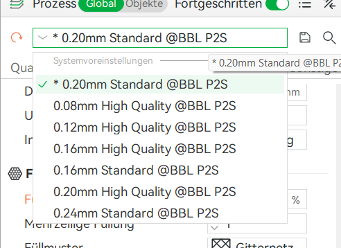
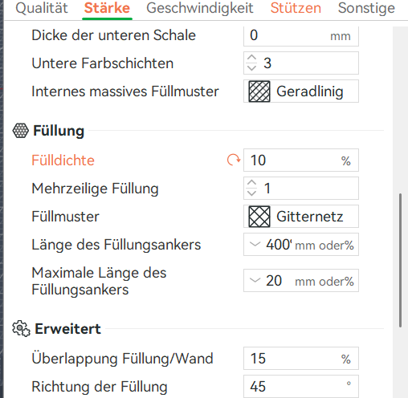
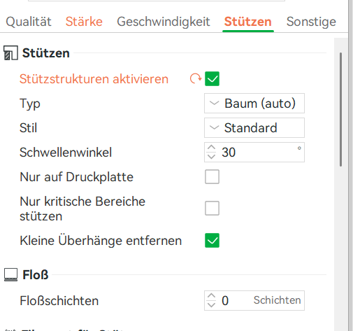
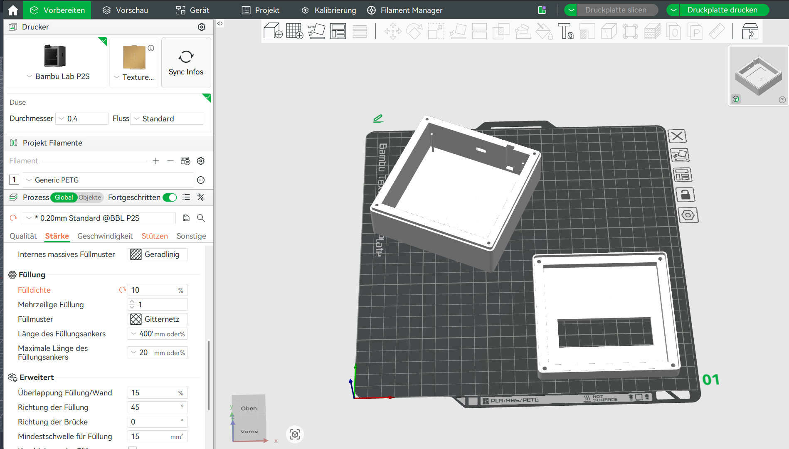
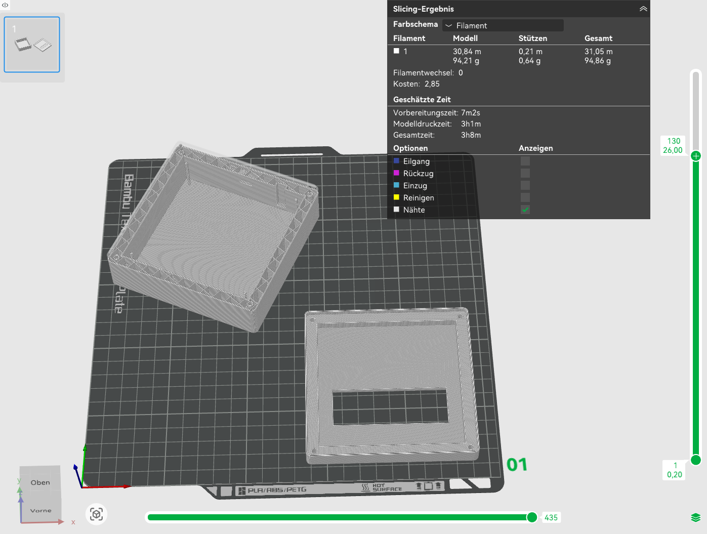
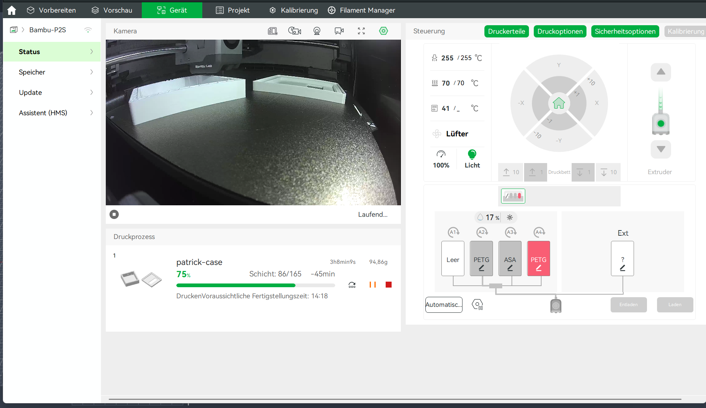

== Themenstellung von Patrik Alzo

[.lead]
Planung, Test und Erstellung einer Datenbank zur Speicherung der erfassten Daten.
Zusätzlich Konstruktion, Druck und Prüfung eines selbst entworfenen Gehäuses für die Hardware.

Die vorliegende Arbeit ist Teil des Gesamtprojekts _TimeCortex_, eines RFID-gestützten Zeiterfassungssystems.
Während die anderen Teilarbeiten die Platine, den Mikrocontroller-Code und die Webanwendung behandeln, befasst sich dieser Abschnitt mit zwei voneinander getrennten, aber für das Gesamtsystem zentralen Bausteinen: dem _physischen Gehäuse_, das die Hardware schützt und benutzbar macht, sowie der _Datenbank_, in der sämtliche erfassten Arbeitszeitdaten dauerhaft und konsistent gespeichert werden.
Ergänzend wird der serverseitige Zugriff auf diese Datenbank mit PHP sowie die clientseitige Aufbereitung der Daten mit JavaScript beschrieben, da erst das Zusammenspiel dieser Schichten aus den gespeicherten Rohdaten eine nutzbare Anwendung macht.

=== Grundlagen des 3D-Druckes

Bevor das konkrete Gehäuse konstruiert und gedruckt werden kann, ist ein grundlegendes Verständnis der zugrunde liegenden Fertigungstechnologie notwendig.
Nur wer das Funktionsprinzip, die typischen Grenzen und die Fehlerquellen des Verfahrens kennt, kann ein Bauteil so konstruieren, dass es sich überhaupt fertigen lässt und die geforderten Eigenschaften erfüllt.
Aus diesem Grund wird in diesem Kapitel zunächst das allgemeine Prinzip der additiven Fertigung erläutert und anschließend schrittweise auf das konkret verwendete Verfahren und den eingesetzten Drucker eingegrenzt.

==== Funktionsprinzip der additiven Fertigung

Unter additiver Fertigung – umgangssprachlich _3D-Druck_ – versteht man die Herstellung eines dreidimensionalen Objekts aus einem digitalen Modell, bei der das Material schrittweise hinzugefügt und verbunden wird, typischerweise Schicht für Schicht (vgl. <<wiki-3dprint>>).
Der Begriff steht damit im direkten Gegensatz zur _subtraktiven Fertigung_, dem Sammelbegriff für spanende Verfahren wie Fräsen oder Drehen, deren gemeinsames Merkmal der Materialabtrag aus einem Rohling ist.

Der grundlegende konzeptionelle Unterschied hat weitreichende praktische Folgen.
Bei subtraktiven Verfahren steigt der Aufwand mit der geometrischen Komplexität des Bauteils, weil jede Hinterschneidung und jede Bohrung eigene Werkzeugwege und oft Umspannvorgänge erfordert.
Bei der additiven Fertigung ist die Komplexität der Geometrie hingegen weitgehend "kostenlos", da ohnehin jede Schicht einzeln aufgebaut wird – ein Hohlraum oder eine organisch geformte Wand verursacht prinzipiell keinen Mehraufwand gegenüber einem massiven Quader gleicher Abmessung.
Dafür entstehen andere Einschränkungen, etwa die Notwendigkeit von Stützstrukturen bei Überhängen und eine richtungsabhängige Festigkeit, auf die in den folgenden Abschnitten eingegangen wird.

Die additive Fertigung ist kein einzelnes Verfahren, sondern eine ganze Verfahrensfamilie.
Die Norm ISO/ASTM 52900 fasst die existierenden Technologien in sieben Verfahrensklassen zusammen (vgl. <<iso-52900>>).

.Die sieben Verfahrensklassen der additiven Fertigung nach ISO/ASTM 52900
[cols="1,3",options="header"]
|===
| Verfahrensklasse | Kurzbeschreibung
| Material Extrusion (MEX) | Selektives Ausbringen von Material durch eine Düse – hierzu gehört das in dieser Arbeit verwendete FDM/FFF-Verfahren.
| Vat Photopolymerization (VPP) | Schichtweises Aushärten eines flüssigen Photopolymers mittels Licht (z.B. SLA, DLP).
| Powder Bed Fusion (PBF) | Verschmelzen eines Pulverbetts mit Laser oder Elektronenstrahl (z.B. SLS, SLM).
| Binder Jetting (BJT) | Selektives Einbringen eines Bindemittels in ein Pulverbett.
| Material Jetting (MJT) | Tröpfchenweises Auftragen und Aushärten eines Werkstoffs (vergleichbar dem Tintenstrahldruck).
| Directed Energy Deposition (DED) | Auftragen und gleichzeitiges Aufschmelzen von Material, meist für Metall.
| Sheet Lamination (SHL) | Verbinden und Zuschneiden aufeinandergelegter Materialschichten.
|===

Für ein Gehäuse aus Kunststoff, das in einer Schul- bzw. Hobbyumgebung gefertigt wird, ist die Materialextrusion das mit Abstand wirtschaftlichste und am leichtesten zugängliche Verfahren.
Es benötigt weder gesundheitsgefährdende Harze noch feine Metallpulver und kommt mit vergleichsweise günstigen Geräten aus.

==== Das FDM/FFF-Verfahren

Innerhalb der Materialextrusion ist das _Fused Deposition Modeling_ (FDM) das dominierende Verfahren.
Ein endloser Kunststofffaden, das sogenannte _Filament_, wird von einer Spule abgewickelt, durch einen beheizten Druckkopf geführt, dort aufgeschmolzen und durch eine feine Düse Schicht für Schicht auf die Bauplattform bzw. auf die bereits gedruckten Schichten aufgetragen (vgl. <<wiki-fff>>).
Unmittelbar nach dem Austritt kühlt der Kunststoff ab, erstarrt und verschmilzt dabei mit der darunterliegenden Schicht.

Begrifflich ist eine Unterscheidung wichtig, die in der Literatur häufig synonym verwendet wird.
Der Ausdruck _Fused Deposition Modeling_ wurde von S. Scott Crump, einem Mitgründer der Firma Stratasys, Ende der 1980er-Jahre entwickelt und 1989 patentiert; "FDM" ist bis heute eine eingetragene Marke von Stratasys (vgl. <<wevolver-fdm>>).
Um eine markenrechtlich unbedenkliche Bezeichnung zur Verfügung zu haben, prägten Mitglieder des offenen RepRap-Projekts ab 2005 den gleichbedeutenden Begriff _Fused Filament Fabrication_ (FFF).
Technisch beschreiben beide Abkürzungen denselben Vorgang; in dieser Arbeit wird überwiegend die verbreitete Bezeichnung FDM verwendet.

==== Aufbau und Funktionsweise eines FDM-Druckers

Ein FDM-Drucker besteht im Kern aus wenigen funktionalen Baugruppen, deren Zusammenspiel die Druckqualität bestimmt.

* Der _Extruder_ fördert das feste Filament mit einem angetriebenen Zahnrad in Richtung Druckkopf und erzeugt dort den nötigen Vorschubdruck.
* Das _Hotend_ schmilzt das Filament unmittelbar vor der Düse auf und gibt es durch die typischerweise 0,4 mm große Düsenöffnung ab.
* Das _beheizte Druckbett_ sorgt für die Haftung der ersten Schicht und verringert das Verziehen des Bauteils.
* Das _Bewegungssystem_ positioniert Druckkopf und Bett relativ zueinander in den drei Raumachsen.

Beim Bewegungssystem haben sich unterschiedliche Bauformen etabliert.
Klassische Geräte nach dem _kartesischen_ Prinzip bewegen die Achsen weitgehend unabhängig voneinander, was einfach aufzubauen, aber bei hohen Geschwindigkeiten durch die bewegten Massen begrenzt ist.
Der in diesem Projekt eingesetzte Drucker arbeitet hingegen nach der _CoreXY_-Kinematik, bei der zwei fest montierte Motoren über ein gekreuztes Riemensystem gemeinsam die X- und Y-Bewegung erzeugen (vgl. <<bambu-p2s-wiki>>).
Da die schweren Motoren nicht mitbewegt werden müssen, lassen sich deutlich höhere Geschwindigkeiten und Beschleunigungen bei guter Präzision erreichen.

Für diese Arbeit wurde der Drucker _Bambu Lab P2S_ verwendet.
Es handelt sich um ein CoreXY-Gerät mit vollständig geschlossenem Bauraum, dessen wichtigste Kenndaten in der folgenden Tabelle zusammengefasst sind.

.Technische Eckdaten des verwendeten Druckers Bambu Lab P2S
[cols="2,3",options="header"]
|===
| Merkmal | Wert
| Kinematik | CoreXY
| Bauraum (B × T × H) | 256 × 256 × 256 mm
| Bauraum geschlossen | ja (passiv temperiert, keine aktive Kammerheizung)
| max. Düsentemperatur | 300 °C
| max. Druckbett-Temperatur | 110 °C
| max. Druckgeschwindigkeit | 600 mm/s
| max. Beschleunigung | 20.000 mm/s²
| Standard-Düse | 0,4 mm
| Multimaterial-System | AMS 2 Pro, 4 Filament-Slots
|===

Der geschlossene Bauraum ist für diese Arbeit besonders relevant.
Er hält die Wärme im Inneren, schirmt Zugluft ab und ist damit eine wichtige Voraussetzung, um auch verzugsanfällige Materialien sauber drucken zu können (vgl. <<bambu-p2s-specs>>).
Das angeschlossene _Automatic Material System_ (AMS 2 Pro) erlaubt es zudem, mehrere Filamente bereitzuhalten und automatisch zu wechseln; im konkreten Druck wurde diese Funktion jedoch nur zur Auswahl der aktiven Spule genutzt.

==== Vom 3D-Modell zum Druck: der Slicing-Prozess

Ein 3D-Drucker kann mit einem CAD-Modell nichts unmittelbar anfangen, denn er versteht keine geschlossenen Volumenkörper, sondern nur konkrete Bewegungs- und Extrusionsbefehle.
Die Übersetzung zwischen beiden Welten übernimmt eine spezielle Software, der sogenannte _Slicer_.
Er zerlegt das Modell – meist im STL-Format – in horizontale Schichten und erzeugt daraus _G-Code_, eine Folge von Anweisungen, die dem Drucker für jede Schicht exakt vorgeben, wohin der Druckkopf fährt und wie viel Material er dabei abgibt (vgl. <<natives-bambustudio>>).

Der grundsätzliche Ablauf vom Modell bis zum fertigen Bauteil lässt sich als einfache Prozesskette darstellen.

[plantuml,format=svg]
----
@startuml
skinparam shadowing false
skinparam activity {
  BackgroundColor #EEF5FF
  BorderColor #2C6FB5
}
start
:CAD-Konstruktion;
:Export als STL-Datei;
:Import in den Slicer\n(Bambu Studio);
:Druckparameter wählen\n(Material, Schichthöhe, Infill, Stützen);
:Slicing -> G-Code;
:Übertragung an den Drucker;
:Schichtweiser Druck;
:Nachbearbeitung\n(Stützen entfernen);
stop
@enduml
----

Im vorliegenden Projekt wurde der Slicer _Bambu Studio_ eingesetzt, die auf PrusaSlicer basierende, quelloffene Software des Druckerherstellers (vgl. <<bambu-studio-wiki>>).
Welche konkreten Parameter dabei gewählt wurden und warum, ist Gegenstand des nächsten Hauptkapitels.

==== Schichtaufbau, Haftung und typische Druckfehler

Da ein FDM-Bauteil aus vielen aufeinander verschmolzenen Schichten besteht, ist seine Festigkeit _anisotrop_: in Schichtebene ist es stabiler als senkrecht dazu, weil die Bindung zwischen den Schichten schwächer ist als das Material innerhalb einer Schicht.
Diese Eigenschaft muss bei der Konstruktion mitgedacht werden, indem man die zu erwartende Belastung möglichst in die Schichtebene legt.

Die Qualität eines Drucks hängt entscheidend von der Haftung ab – sowohl der ersten Schicht auf dem Druckbett als auch der Schichten untereinander.
Treten hier Probleme auf, äußern sie sich in charakteristischen Druckfehlern, die in der folgenden Tabelle mit ihren häufigsten Ursachen zusammengefasst sind.

.Typische FDM-Druckfehler und ihre Ursachen
[cols="1,3",options="header"]
|===
| Fehlerbild | Häufige Ursache
| Warping (Verzug) | Schrumpfung beim Abkühlen zieht die Ecken vom Bett hoch; verstärkt bei zu kaltem Bett oder Zugluft (vgl. <<s3d-warping>>).
| Layer-Shifting (Schichtversatz) | Druckkopf zu schnell oder mechanisches Problem wie lose Riemen; Folgeschichten sind seitlich verschoben (vgl. <<s3d-layershift>>).
| Stringing (Fädenbildung) | Austretender Kunststoff bei Leerfahrten durch zu geringe Retraktion oder zu hohe Düsentemperatur (vgl. <<s3d-stringing>>).
| Elephant Foot (Elefantenfuß) | Düse zu nah am Bett, die untersten Schichten werden breitgequetscht (vgl. <<natives-elephant>>).
| Schlechte Schichthaftung | Schichthöhe zu groß oder Drucktemperatur zu niedrig, die Schichten verschmelzen unzureichend (vgl. <<s3d-layersplit>>).
|===

Das Wissen um diese Fehlerbilder ist nicht nur theoretisch relevant.
Wie in <<konstruktion>> gezeigt wird, lässt sich ein Teil der konstruktiven Schwachstellen des ersten Gehäuseentwurfs direkt auf solche fertigungsbedingten Effekte und die geometriebedingte Verzugsneigung zurückführen.

=== Auswahl der Druckparameter und Kunststoffe

Ein gelungenes Druckergebnis ist immer das Resultat zweier eng verzahnter Entscheidungen: der Wahl des _Materials_ und der Wahl der _Druckparameter_.
Beide müssen zu den Anforderungen des konkreten Bauteils passen.
Daher werden in diesem Kapitel zunächst die Anforderungen an das Gehäuse formuliert, anschließend die in Frage kommenden Kunststoffe verglichen und schließlich die einzelnen Parameter begründet, mit denen das Gehäuse tatsächlich gedruckt wurde.

==== Anforderungen an das Gehäuse

Das Gehäuse umschließt die Elektronik des Zeiterfassungsterminals – im Wesentlichen die Platine, den Mikrocontroller und ein NFC-/RFID-Lesefeld.
Daraus ergeben sich mehrere Anforderungen.

* _Schutz_: Die Elektronik muss gegen mechanische Beschädigung und versehentliche Berührung geschützt sein.
* _Zugänglichkeit_: Der Deckel soll sich für Wartung und Reparatur zerstörungsfrei öffnen und wieder verschließen lassen.
* _Funktionsfähigkeit der Sensorik_: Das NFC-Lesefeld muss nahe der Oberfläche liegen, da das Magnetfeld nur eine geringe Reichweite besitzt; über dem Lesefeld darf kein metallisches Material und nur eine dünne Kunststoffwand liegen.
* _Maßhaltigkeit_: Aussparungen für Anschlüsse und das Display müssen passgenau sitzen.
* _Robustheit im Alltag_: Da das Terminal regelmäßig benutzt wird, müssen vor allem der Verschlussmechanismus und die Kanten eine gewisse Schlagzähigkeit aufweisen.
* _Temperaturtoleranz_: Das Gehäuse soll sich durch die Abwärme der Elektronik und durch Umgebungswärme nicht verformen.

Insbesondere die Forderungen nach Schlagzähigkeit und Temperaturtoleranz schließen einige sonst beliebte Materialien faktisch aus, wie der folgende Vergleich zeigt.

==== Vergleich gängiger Kunststoffe (PLA, PETG, ASA)

Für den FDM-Druck stehen zahlreiche Thermoplaste zur Verfügung.
Für ein Funktionsgehäuse sind in der Praxis vor allem drei Materialien relevant: PLA, PETG und ASA.
Sie unterscheiden sich deutlich in Druckbarkeit, mechanischen Eigenschaften und Beständigkeit.

.Vergleich der Kunststoffe PLA, PETG und ASA
[cols="2,2,2,2",options="header"]
|===
| Eigenschaft | PLA | PETG | ASA
| Düsentemperatur | 190–220 °C | 230–250 °C | 240–260 °C
| Druckbett-Temperatur | 45–60 °C | 75–90 °C | 90–110 °C
| Glasübergangstemperatur | ~60 °C | ~80–85 °C | ~100–105 °C
| Mechanik | steif, aber spröde | zäh, schlagzäh, leicht flexibel | sehr schlag- und verschleißfest
| UV-/Witterungsbeständigkeit | gering | gut | sehr gut
| Verzugsneigung (Warping) | gering | gering | hoch
| Emissionen beim Druck | gering | sehr gering | Styroldämpfe, Absaugung empfohlen
| Geschlossener Bauraum nötig | nein | nein | praktisch ja
| Typische Anwendung | Prototypen, Deko | Funktionsteile, Gehäuse | Außen-/Kfz-Teile
|===

Die Werte beruhen auf den Materialdatenblättern und Hersteller-Empfehlungen (vgl. <<prusa-pla>>, <<prusa-petg>>, <<prusa-asa>>, <<simplify-petg>>).
PLA ist am einfachsten zu drucken, aber spröde und mit einer Glasübergangstemperatur von nur etwa 60 °C wenig wärmebeständig – es kann sich bereits in einem in der Sonne stehenden Auto verformen.
ASA bietet die besten mechanischen und Witterungseigenschaften, neigt jedoch stark zum Verziehen, setzt beim Druck Styroldämpfe frei und verlangt einen geschlossenen, möglichst beheizten Bauraum.
PETG positioniert sich zwischen diesen Polen.

==== Begründung der Materialwahl

Für das Gehäuse fiel die Wahl auf _PETG_.

PETG gilt als guter Kompromiss zwischen der einfachen Druckbarkeit von PLA und der Robustheit technischer Kunststoffe wie ABS oder ASA (vgl. <<ultimaker-compare>>).
Es ist zäh und leicht flexibel statt spröde, sodass der für ein Gehäuse kritische Verschlussmechanismus nicht sofort bricht, sondern Belastungen elastisch aufnehmen kann.
Mit einer Glasübergangstemperatur von rund 80 °C ist es deutlich wärmebeständiger als PLA und übersteht die Abwärme der Elektronik problemlos (vgl. <<prusa-petg>>).
Gleichzeitig zeigt es – anders als ASA – nur eine geringe Verzugsneigung und lässt sich nahezu geruchsfrei und ohne zwingende Absaugung verarbeiten.

Eine Verwendung von ASA wäre aus Sicht der mechanischen und thermischen Eigenschaften ebenfalls denkbar gewesen und hätte zusätzlich eine sehr gute UV-Beständigkeit für den Außeneinsatz geboten.
Da das Terminal jedoch im Innenraum betrieben wird, die hohe Warping-Neigung von ASA gerade bei der flächigen Grundplatte des Gehäuses Probleme bereitet hätte und PETG die geforderte Schlagzähigkeit bereits sicher erfüllt, wurde PETG als bestmöglicher Kompromiss aus Robustheit, Druckbarkeit und Sicherheit gewählt.

In den folgenden Abschnitten werden die einzelnen Slicer-Parameter erläutert, die für diesen Druck verwendet wurden.
Die Werte stammen aus dem dokumentierten Druckauftrag des Projekts (Profil _0,20 mm Standard @BBL P2S_).

==== Schichthöhe und Auflösung

Die Schichthöhe bestimmt die vertikale Auflösung und damit den sichtbaren Treppenstufeneffekt an schrägen Flächen sowie die Druckdauer.
Als grobe Faustregel sollte die Schichthöhe etwa 25 % bis maximal 75–80 % des Düsendurchmessers betragen (vgl. <<prusa-layers>>).
Bei der verwendeten 0,4-mm-Düse ist eine Schichthöhe von 0,20 mm daher ein bewährter Mittelwert zwischen Oberflächenqualität und Geschwindigkeit.

.Auswahl des Druckprofils in Bambu Studio
[#fig-slicer-profil]

Für ein zweckmäßiges Gehäuse ohne hohe optische Ansprüche wäre auch ein gröberes Profil mit 0,24 mm oder 0,28 mm vertretbar gewesen, was die Druckzeit verkürzt hätte.
Umgekehrt hätten feinere Profile bis 0,08 mm die Oberfläche verbessert, aber die Druckdauer vervielfacht – ein für ein Funktionsbauteil unnötiger Aufwand.
Das gewählte Standardprofil von 0,20 mm stellt den praxisüblichen Kompromiss dar.

==== Fülldichte und Füllmuster (Infill)

Das Innere eines gedruckten Bauteils ist in der Regel nicht massiv, sondern wird mit einem regelmäßigen Gitter, dem _Infill_, ausgefüllt.
Die _Fülldichte_ gibt an, wie viel Prozent des Innenvolumens tatsächlich mit Material gefüllt werden; das _Füllmuster_ bestimmt die geometrische Anordnung dieses Materials.

Eine höhere Fülldichte erhöht Festigkeit und Gewicht, verlängert aber Druckzeit und Materialverbrauch.
In der Praxis genügen für die meisten Bauteile 10–15 %, da die Festigkeit eines Modells überwiegend von den Außenwänden und nicht vom Infill bestimmt wird (vgl. <<prusa-infill>>).
Für das Gehäuse wurde eine Fülldichte von 10 % mit einem Gitternetz-Muster gewählt.

.Einstellung von Fülldichte und Füllmuster im Slicer
[#fig-slicer-staerke]

Diese Wahl ist für ein Gehäuse sinnvoll: Es trägt keine hohen Lasten, sondern muss vor allem formstabil sein und die Elektronik umschließen.
Ein höherer Infill von beispielsweise 30 % hätte das Gewicht und die Druckzeit unnötig erhöht, ohne einen funktionalen Vorteil zu bringen.

==== Wand- und Bodenstärke

Während das Infill das Innere füllt, bestimmen die _Wandstärke_ (Anzahl der äußeren Umrandungen, der sogenannten Perimeter) und die Anzahl der _Boden- und Deckschichten_ die tatsächliche Festigkeit und Dichtigkeit der Außenhülle.
Gerade weil die Festigkeit eines FDM-Bauteils stärker von den Perimetern als vom Infill abhängt, ist eine ausreichende Wandstärke für ein robustes Gehäuse entscheidend (vgl. <<prusa-layers>>).

Im Druckauftrag waren drei untere Schichten (Bodenlagen) eingestellt.
In Kombination mit mehreren Perimetern entsteht so eine geschlossene, tragfähige Außenhülle, die das vergleichsweise dünne 10-%-Infill umschließt und dem Bauteil seine Steifigkeit gibt.
Für ein Gehäuse mit dünner Wand über dem NFC-Lesefeld ist dieser Aufbau ideal, weil die tragende Funktion von den Wänden übernommen wird und das Lesefenster trotzdem dünn bleiben kann.

==== Temperaturführung (Düse, Druckbett, Kammer)

Die Verarbeitungstemperaturen müssen exakt zum Material passen.
Eine zu niedrige Düsentemperatur führt zu schlechter Schichthaftung, eine zu hohe zu Fädenbildung und Verbrennungen; ein zu kaltes Bett verursacht Verzug.

Für den PETG-Druck wurden gemäß Projektdokumentation folgende Temperaturen verwendet.

* _Düsentemperatur_: 255 °C
* _Druckbett-Temperatur_: 70 °C
* _Kammertemperatur_: rund 41 °C (passiv, durch den geschlossenen Bauraum)

Diese Werte liegen genau im empfohlenen Bereich für PETG und nutzen den geschlossenen Bauraum des P2S aus, ohne dass eine aktive Kammerheizung nötig wäre.
Die passiv erhöhte Kammertemperatur stabilisiert die Schichthaftung und reduziert Spannungen im Bauteil.
Bei PLA wären deutlich niedrigere Temperaturen (etwa 210 °C Düse, 60 °C Bett) gewählt worden, bei ASA hingegen höhere Werte und eine möglichst warme Kammer.

==== Stützstrukturen und Überhänge

Da jede Schicht auf der darunterliegenden aufliegen muss, kann ein FDM-Drucker Überhänge nur bis zu einem gewissen Winkel "in die Luft" drucken.
Steilere Überhänge oder freistehende Bauteilbereiche benötigen temporäre _Stützstrukturen_, die nach dem Druck wieder entfernt werden (vgl. <<prusa-support>>).

Im Druckauftrag wurden Stützstrukturen vom Typ _Baum (auto)_ mit einem Schwellenwinkel von 30° aktiviert.

.Einstellung der Stützstrukturen im Slicer
[#fig-slicer-stuetzen]

Baumförmige Stützen verbrauchen weniger Material als klassische gitterförmige Stützen und lassen sich meist leichter ablösen.
Der geringe Stützenanteil von nur 0,64 g am Gesamtgewicht von rund 95 g zeigt, dass das Gehäuse weitgehend stützenarm konstruiert wurde – ein Zeichen für ein druckgerechtes Design, bei dem große Überhänge bewusst vermieden wurden.

==== Druckhaftung und Plattenauswahl

Die erste Schicht entscheidet maßgeblich über den Erfolg des gesamten Drucks, denn löst sich das Bauteil während des Drucks vom Bett, ist der Druck verloren.
Zur Verbesserung der Haftung stehen im Slicer Hilfsmittel wie _Skirt_ (eine vorgelagerte Umrandung zur Stabilisierung des Materialflusses), _Brim_ (ein verbreiteter Rand um die erste Schicht) und _Raft_ (eine mehrlagige Grundplatte) zur Verfügung (vgl. <<prusa-skirt>>).

Im vorliegenden Druck wurde bewusst _ohne Raft_ (Floß: 0 Schichten) gedruckt.
Als Druckunterlage diente die _Bambu Textured PEI Plate_, deren strukturierte Oberfläche bei PETG für eine zuverlässige Haftung sorgt und gleichzeitig der Unterseite des Bauteils eine angenehme, matte Textur verleiht.
Da PETG ohnehin nur gering zum Verzug neigt, war auf der temperierten PEI-Platte weder ein Raft noch ein Brim erforderlich, was Materialverbrauch und Nacharbeit weiter reduziert.

[#konstruktion]
=== Konstruktion und Prüfung des Gehäuses

Nach der Festlegung von Material und Druckparametern folgt die eigentliche Konstruktion.
Charakteristisch für die Produktentwicklung ist, dass selten der erste Entwurf bereits optimal ist.
Dieses Kapitel dokumentiert daher bewusst den iterativen Weg über zwei Designvarianten und macht damit den Erkenntnisgewinn zwischen erstem und zweitem Entwurf nachvollziehbar.

==== Konstruktionsanforderungen der Hardware

Aus den zuvor formulierten allgemeinen Anforderungen ergeben sich konkrete konstruktive Vorgaben.
Das Gehäuse ist zweiteilig aufgebaut und besteht aus einem _Unterteil_, das die Platine aufnimmt, und einem _Deckel_, der das Gehäuse verschließt.

* Das Unterteil besitzt _Standoffs_ (Abstandshalter mit Bohrungen), auf denen die Platine verschraubt bzw. eingesetzt wird, sodass sie nicht direkt auf dem Boden aufliegt.
* Der Deckel trägt eine rechteckige Aussparung für das Display bzw. das Anzeigefenster sowie eine eingeprägte NFC-Markierung, die dem Benutzer die Position des Lesefeldes anzeigt.
* Die Grundfläche beträgt etwa 96 × 96 mm.
* Deckel und Unterteil sollen ohne Schrauben über einen Schnappverschluss zusammengehalten werden, um das Öffnen werkzeuglos zu ermöglichen.

Gerade der letzte Punkt – ein zuverlässiger, werkzeugloser Schnappverschluss – erwies sich als die zentrale konstruktive Herausforderung.

==== Erste Konstruktion (Design 1)

Der erste Entwurf setzt den zweiteiligen Aufbau direkt um.
Das Unterteil ist eine offene Wanne mit umlaufender Wand und integrierten Standoffs; der Deckel ist eine flache Platte mit Display-Aussparung und NFC-Prägung.

.Design 1 – Unterteil mit Standoffs
[#fig-design1-unten]

.Design 1 – Deckel mit NFC-Prägung
[#fig-design1-deckel]

Der Deckel wird bei diesem Entwurf ausschließlich über zwei schmale Schnapp-Laschen an der Vorder- und der Rückseite gehalten.
An den beiden Seitenwänden gibt es keine Verriegelung.
Dieser Aufbau ist einfach und materialsparend, weist aber gravierende Schwächen auf, die erst in der praktischen Erprobung deutlich zutage traten.

==== Konstruktive Schwachstellen des Schnappverschlusses

Die Erprobung des ersten Gehäuses offenbarte zwei wesentliche, miteinander zusammenhängende Probleme.

Erstens fehlt aufgrund der nur an zwei Punkten angebrachten Verriegelung in der Mitte der Seitenwände jeglicher Gegenhalt.
Bei der Gehäusegröße von rund 96 × 96 mm biegt sich der Deckel dort nach oben und schließt nicht mehr bündig ab – es entsteht ein sichtbarer Spalt an den Seiten.
Dies ist eine unmittelbare Folge der großen, nur an den Enden gestützten Spannweite und wird durch die geringe Eigensteifigkeit der dünnen Deckelplatte verstärkt.

Zweitens sind die Schnapphaken mit nur 0,9 mm Materialstärke sehr filigran ausgeführt.
In Verbindung mit dem schichtweisen Aufbau des FDM-Drucks, bei dem die Schichtgrenzen Sollbruchstellen quer zur Belastung darstellen, sind die Haken äußerst zerbrechlich.
Beim wiederholten Öffnen und Schließen brechen sie leicht ab, und die Verrastung nutzt sich bereits nach wenigen Benutzungen sichtbar ab.

Zusammengefasst krankte das erste Design an _zu wenigen, zu dünnen und ungleichmäßig verteilten_ Schnapppunkten.
Die Schwachstellen sind damit nicht primär ein Fertigungs-, sondern ein Konstruktionsproblem, das nur durch eine Überarbeitung der Geometrie zu beheben war.

==== Überarbeitete Konstruktion (Design 2)

Im zweiten Entwurf wurde der Verschluss grundlegend neu gestaltet.
Statt nur zweier punktueller Laschen ist der Verschluss nun gleichmäßig über den gesamten Gehäuseumfang verteilt.

.Design 2 – zusammengesetztes Gehäuse
[#fig-design2-case]

.Design 2 – überarbeitetes Unterteil
[#fig-design2-unten]

.Design 2 – überarbeiteter Deckel
[#fig-design2-deckel]

Durch die umlaufende Verteilung des Verschlusses liegt der Deckel an allen Seiten gleichmäßig auf.
Der zuvor störende Spalt an den Seitenwänden entfällt, weil die Mitte der langen Seiten nun ebenfalls gehalten wird.
Der Schließdruck verteilt sich gleichmäßiger auf viele Kontaktstellen, sodass die einzelne Verbindung weniger stark belastet wird und die gesamte Mechanik robuster und weniger bruchanfällig ist.

==== Vergleich und Bewertung beider Gehäuse

Die folgende Tabelle stellt die beiden Entwürfe einander gegenüber.

.Gegenüberstellung von Design 1 und Design 2
[cols="2,2,2",options="header"]
|===
| Kriterium | Design 1 | Design 2
| Verschlussprinzip | 2 punktuelle Laschen (vorne/hinten) | umlaufend verteilte Verriegelung
| Anliegen des Deckels | Spalt an den Seiten | überall bündig
| Schließdruck | ungleichmäßig, auf 2 Punkte konzentriert | gleichmäßig verteilt
| Bruchgefahr der Haken | hoch (0,9 mm, filigran) | deutlich reduziert
| Wiederholtes Öffnen/Schließen | Verrastung nutzt sich schnell ab | dauerhaft stabiler
| Bewertung | funktional, aber nicht alltagstauglich | alltagstaugliche Lösung
|===

Der Vergleich zeigt exemplarisch ein zentrales Prinzip druckgerechten Konstruierens: Belastungen sollten auf möglichst viele, ausreichend dimensionierte Kontaktstellen verteilt werden, statt sie an wenigen filigranen Punkten zu konzentrieren.
Damit erfüllt Design 2 die eingangs formulierten Anforderungen an Robustheit und Zugänglichkeit, die Design 1 verfehlt hatte.

==== Druckergebnis und Funktionsprüfung

Das überarbeitete Gehäuse wurde mit den zuvor beschriebenen Parametern auf dem Bambu Lab P2S gedruckt.
Beide Bauteile – Unterteil und Deckel – wurden gemeinsam auf der Druckplatte angeordnet.

.Anordnung der Bauteile auf der Druckplatte (Generic PETG)
[#fig-slicer-platte]

Das Slicing ergab folgende Eckdaten für den Druckauftrag _patrick-case_.

.Kenndaten des Druckauftrags
[cols="2,2",options="header"]
|===
| Größe | Wert
| Material | PETG (Generic PETG)
| Schichten gesamt | 165
| Modelldruckzeit | ca. 3 h 1 min
| Materialverbrauch | 94,86 g (Modell 94,21 g + Stützen 0,64 g)
| Filamentlänge | 31,05 m
| Materialkosten | ca. 2,85 €
| Druckplatte | Bambu Textured PEI Plate
|===

.Slicing-Ergebnis mit Zeit-, Material- und Kostenabschätzung
[#fig-slicer-ergebnis]

Während des Drucks ließ sich der Fortschritt über die integrierte Kamera und die Statusanzeige des Druckers überwachen.

.Statusüberwachung des laufenden Drucks
[#fig-slicer-status]

In der abschließenden Funktionsprüfung erfüllte das gedruckte Gehäuse seine Aufgaben.
Der Deckel ließ sich werkzeuglos schließen und wieder öffnen, lag dank des umlaufenden Verschlusses bündig auf und zeigte keinen Spalt mehr.
Die Display-Aussparung und die Standoffs für die Platine passten maßhaltig, und die dünne Wand über dem NFC-Feld beeinträchtigte die Lesefunktion nicht.
Damit ist der konstruktive Teil der Aufgabenstellung – Konstruktion, Druck und Prüfung eines selbst entworfenen Gehäuses – erfolgreich abgeschlossen.

=== Datenbankschema der Applikation

Der zweite Schwerpunkt dieser Arbeit ist die Datenbank, in der sämtliche Arbeitszeitdaten dauerhaft gespeichert werden.
Eine durchdachte Datenbankstruktur ist die Grundlage jeder datengetriebenen Anwendung, weil sich Fehler im Datenmodell später nur mit großem Aufwand korrigieren lassen.
Daher wird das Schema zunächst anhand der fachlichen Anwendungsfälle geplant, anschließend in seiner technischen Umsetzung beschrieben und schließlich getestet und validiert.

==== Planung des Datenmodells anhand von Use Cases

Am Anfang der Datenmodellierung steht die Frage, _welche_ Informationen die Anwendung überhaupt verarbeiten muss.
Diese ergeben sich aus den Anwendungsfällen (Use Cases) des Systems.
Im Zeiterfassungssystem _TimeCortex_ treten drei Rollen auf – Mitarbeiter, Manager und Administrator – mit unterschiedlichen Aufgaben.

[plantuml,format=svg]
----
@startuml
left to right direction
skinparam shadowing false
skinparam packageStyle rectangle

actor Mitarbeiter as MA
actor Manager as MG
actor Administrator as AD

rectangle "Zeiterfassungssystem" {
  usecase "Kommen/Gehen buchen" as UC1
  usecase "Pause erfassen" as UC2
  usecase "Abwesenheit beantragen" as UC3
  usecase "Eigene Zeiten einsehen" as UC4
  usecase "Abwesenheiten genehmigen" as UC5
  usecase "Berichte erzeugen" as UC6
  usecase "Benutzer verwalten" as UC7
  usecase "Anstellungsart pflegen" as UC8
}

MA --> UC1
MA --> UC2
MA --> UC3
MA --> UC4
MG --> UC5
MG --> UC6
AD --> UC5
AD --> UC6
AD --> UC7
AD --> UC8
@enduml
----

Aus diesen Anwendungsfällen lassen sich die benötigten Datenobjekte ableiten.

* Aus _Kommen/Gehen buchen_ folgt die Notwendigkeit, pro Mitarbeiter und Tag eine _Anwesenheitsaufzeichnung_ mit Start- und Endzeit zu speichern.
* Aus _Pause erfassen_ folgt eine eigene Entität für _Pausen_, die einer Anwesenheitsaufzeichnung zugeordnet sind.
* Aus _Abwesenheit beantragen/genehmigen_ folgt eine Entität für _Abwesenheiten_ inklusive Status und Typ (Urlaub, Krank usw.).
* Aus der Rollen- und Rechteverwaltung folgen Entitäten für _Benutzer_, deren _Profile_ (mit Rolle) und die _Login-Daten_.
* Aus _Anstellungsart pflegen_ folgen die _Anstellungsarten_ mit Soll-Arbeitszeit sowie ein _Verlauf_, der Änderungen über die Zeit nachvollziehbar macht.
* Hinzu kommen unterstützende Entitäten für _Feiertage_, _Benachrichtigungen_, _Berichte_, _Wartungsprotokolle_ und _Passwort-Reset-Anträge_.

Eine bewusste Entwurfsentscheidung ist die Trennung von _Benutzer_, _Benutzerprofil_ und _Login-Daten_ in drei Tabellen.
Diese Aufteilung folgt dem Prinzip der Single Responsibility auf Datenebene: identitätsstiftende Stammdaten, organisatorische Profildaten und sicherheitsrelevante Anmeldedaten werden getrennt gehalten.
So kann etwa ein Mitarbeiter im System angelegt sein (Stammdaten), bevor er sich überhaupt registriert hat und dadurch Login-Daten besitzt – ein Umstand, den die Registrierung weiter unten gezielt ausnutzt.

==== Realisiertes physisches Schema

Aus dem konzeptionellen Modell wurde ein physisches Schema in Form einer MariaDB-/MySQL-Datenbank mit der Speicher-Engine _InnoDB_ abgeleitet.
InnoDB wurde gewählt, weil sie als einzige der gängigen MySQL-Engines _Fremdschlüssel_ und _Transaktionen_ unterstützt und damit die referenzielle Integrität auf Datenbankebene durchsetzen kann.
Das folgende Diagramm zeigt die zentralen Tabellen und ihre Beziehungen.

[plantuml,format=svg]
----
@startuml
skinparam shadowing false
skinparam linetype ortho
hide circle

entity benutzer {
  * benutzer_id : INT <<PK>>
  --
  name : VARCHAR
  email : VARCHAR
  nfc_karte_id : VARCHAR
}

entity login_daten {
  * login_id : INT <<PK>>
  --
  benutzer_id : INT <<FK>>
  benutzername : VARCHAR
  passwort_hash : VARCHAR
}

entity benutzerprofile {
  * profil_id : INT <<PK>>
  --
  benutzer_id : INT <<FK>>
  rolle : ENUM
  anstellungs_art_id : INT
}

entity anstellungsarten {
  * art_id : INT <<PK>>
  --
  bezeichnung : VARCHAR
  soll_stunden_pro_tag : TIME
}

entity anstellungsart_verlauf {
  * verlauf_id : INT <<PK>>
  --
  benutzer_id : INT
  anstellungs_art_id : INT
  gueltig_ab : DATE
}

entity anwesenheitsaufzeichnungen {
  * anwesenheit_id : INT <<PK>>
  --
  benutzer_id : INT <<FK>>
  anwesenheits_datum : DATE
  start_arbeitszeit : TIME
  ende_arbeitszeit : TIME
}

entity pausen {
  * pause_id : INT <<PK>>
  --
  benutzer_id : INT <<FK>>
  anwesenheit_id : INT <<FK>>
  start_pause : DATETIME
  ende_pause : DATETIME
}

entity abwesenheiten {
  * abwesenheit_id : INT <<PK>>
  --
  benutzer_id : INT <<FK>>
  abwesenheit_typ : ENUM
  status : ENUM
}

benutzer ||--|| login_daten
benutzer ||--|| benutzerprofile
benutzer ||--o{ anwesenheitsaufzeichnungen
benutzer ||--o{ abwesenheiten
benutzer ||--o{ anstellungsart_verlauf
anwesenheitsaufzeichnungen ||--o{ pausen
anstellungsarten ||--o{ benutzerprofile
@enduml
----

Die Tabelle `benutzer` bildet den Kern des Schemas; nahezu alle übrigen Tabellen verweisen über eine `benutzer_id` auf sie.
Die folgende Anweisung zeigt exemplarisch die Definition der Tabelle `anwesenheitsaufzeichnungen`, in der die eigentlichen Arbeitszeiten gespeichert werden.

.Tabellendefinition der Arbeitszeit-Aufzeichnungen
[source,sql]
----
CREATE TABLE `anwesenheitsaufzeichnungen` (
  `anwesenheit_id`     int(11) NOT NULL,                 -- <1>
  `benutzer_id`        int(11) DEFAULT NULL,             -- <2>
  `anwesenheits_datum` date NOT NULL,                    -- <3>
  `start_arbeitszeit`  time NOT NULL,
  `ende_arbeitszeit`   time NOT NULL,
  `stunden_differenz`  time DEFAULT NULL                 -- <4>
) ENGINE=InnoDB DEFAULT CHARSET=utf8mb4;

ALTER TABLE `anwesenheitsaufzeichnungen`
  ADD PRIMARY KEY (`anwesenheit_id`),                    -- <5>
  ADD KEY `benutzer_id` (`benutzer_id`);                 -- <6>

ALTER TABLE `anwesenheitsaufzeichnungen`
  ADD CONSTRAINT `anwesenheitsaufzeichnungen_ibfk_1`
  FOREIGN KEY (`benutzer_id`)
  REFERENCES `benutzer` (`benutzer_id`);                 -- <7>
----

<1> Künstlicher Primärschlüssel (Surrogate Key), der jede Aufzeichnung eindeutig identifiziert.
<2> Fremdschlüsselspalte, die den Datensatz einem Benutzer zuordnet.
<3> Datum des Arbeitstages; zusammen mit `benutzer_id` identifiziert es einen Arbeitstag fachlich.
<4> Vorberechnete Netto-Differenz, die das spätere Auslesen vereinfacht.
<5> Festlegung des Primärschlüssels.
<6> Index auf der Fremdschlüsselspalte beschleunigt das Filtern nach Benutzer.
<7> Fremdschlüssel-Constraint erzwingt, dass nur existierende Benutzer referenziert werden können.

Eine besonders saubere Modellierung zeigt die Pausen-Tabelle, deren Fremdschlüssel mit der Option `ON DELETE CASCADE` definiert sind.

.Fremdschlüssel der Pausen mit kaskadierendem Löschen
[source,sql]
----
ALTER TABLE `pausen`
  ADD CONSTRAINT `pausen_ibfk_1` FOREIGN KEY (`benutzer_id`)
    REFERENCES `benutzer` (`benutzer_id`) ON DELETE CASCADE,          -- <1>
  ADD CONSTRAINT `pausen_ibfk_2` FOREIGN KEY (`anwesenheit_id`)
    REFERENCES `anwesenheitsaufzeichnungen` (`anwesenheit_id`)
    ON DELETE CASCADE;                                                 -- <2>
----

<1> Wird ein Benutzer gelöscht, werden automatisch alle zugehörigen Pausen mitgelöscht.
<2> Wird eine Anwesenheitsaufzeichnung gelöscht, verschwinden auch deren Pausen – verwaiste Datensätze können so nicht entstehen.

Diese Kaskadierung verhindert _Dateninkonsistenzen_: Es kann keine Pause geben, die auf einen nicht mehr existierenden Arbeitstag verweist.
Die Verantwortung für die referenzielle Integrität liegt damit in der Datenbank selbst und nicht im Anwendungscode, was Fehler durch vergessene Lösch-Logik im PHP-Code ausschließt.

==== Test und Validierung des Schemas

Ein Datenbankschema gilt erst dann als gesichert, wenn es mit realistischen Daten und realen Abfragen geprüft wurde.
Die Validierung erfolgte auf mehreren Ebenen.

Erstens wurde das Schema mit umfangreichen _Testdaten_ befüllt.
Die Datenbank enthält über mehrere Monate generierte Anwesenheitsaufzeichnungen für mehrere Mitarbeiter, dazugehörige Pausen, Abwesenheiten verschiedener Typen sowie Feiertage für zwei Jahre.
Diese Datenmenge stellt sicher, dass die Abfragen nicht nur an wenigen Idealdatensätzen, sondern unter praxisnahen Bedingungen funktionieren.

Zweitens wurde die _referenzielle Integrität_ getestet, indem geprüft wurde, ob die Fremdschlüssel-Constraints fehlerhafte Operationen tatsächlich verhindern.
Der Versuch, eine Pause für eine nicht existierende Anwesenheitsaufzeichnung anzulegen, wird von InnoDB mit einem Fehler abgewiesen; das Löschen eines Arbeitstags entfernt dank `ON DELETE CASCADE` automatisch dessen Pausen.

Drittens wurden die _fachlichen Abfragen_ der Anwendung gegen das Schema ausgeführt.
Eine zentrale Auswertung ist etwa die Summierung der geleisteten Arbeitszeit eines Mitarbeiters in einem Zeitraum, wie sie für die Berichtsfunktion benötigt wird.

.Validierungsabfrage: geleistete Stunden je Mitarbeiter und Monat
[source,sql]
----
SELECT b.name,                                            -- <1>
       DATE_FORMAT(a.anwesenheits_datum, '%Y-%m') AS monat,
       SEC_TO_TIME(SUM(TIME_TO_SEC(a.stunden_differenz))) AS summe  -- <2>
FROM anwesenheitsaufzeichnungen a
JOIN benutzer b ON a.benutzer_id = b.benutzer_id          -- <3>
GROUP BY a.benutzer_id, monat                             -- <4>
ORDER BY b.name, monat;
----

<1> Der Join verknüpft jede Aufzeichnung mit dem zugehörigen Benutzernamen.
<2> Die einzelnen Zeitdifferenzen werden in Sekunden umgerechnet, summiert und wieder als Zeit formatiert.
<3> Die Verknüpfung erfolgt über die Fremdschlüsselbeziehung.
<4> Gruppiert wird je Mitarbeiter und Monat, sodass eine monatliche Übersicht entsteht.

Da diese und vergleichbare Abfragen korrekte und plausible Ergebnisse lieferten, gilt das Schema als validiert und für den produktiven Einsatz geeignet.

=== PHP als serverseitige Skriptsprache

Die Datenbank allein ist für den Endanwender nicht nutzbar; es bedarf einer Anwendungsschicht, die Daten entgegennimmt, verarbeitet und darstellt.
Diese Aufgabe übernimmt im Projekt die serverseitige Skriptsprache _PHP_.
Bevor die konkreten Datenbankzugriffe betrachtet werden, ist ein Verständnis des grundlegenden Ausführungsmodells von PHP notwendig.

==== Client-Server-Modell und Request-Response-Zyklus

Eine PHP-Webanwendung folgt dem _Client-Server-Modell_.
Der _Client_ – in der Regel ein Webbrowser – sendet eine Anfrage (Request) an den _Webserver_; dieser führt das PHP-Skript aus und sendet das erzeugte Ergebnis, meist eine HTML-Seite, als Antwort (Response) zurück.
Wichtig ist, dass PHP _vollständig auf dem Server_ ausgeführt wird: Der Client erhält niemals den PHP-Quelltext, sondern nur dessen Ausgabe.

[plantuml,format=svg]
----
@startuml
skinparam shadowing false
actor Benutzer
participant "Browser\n(Client)" as Browser
participant "Webserver\n+ PHP" as Server
database "MySQL/MariaDB" as DB

Benutzer -> Browser : Formular absenden
Browser -> Server : HTTP-Request (POST)
activate Server
Server -> DB : SQL-Abfrage
activate DB
DB --> Server : Ergebnismenge
deactivate DB
Server -> Server : HTML erzeugen
Server --> Browser : HTTP-Response (HTML)
deactivate Server
Browser -> Benutzer : Seite anzeigen
@enduml
----

Dieser Zyklus wiederholt sich bei jeder Interaktion.
Da jeder Request grundsätzlich unabhängig ist und PHP nach der Antwort seinen Zustand verliert, ist PHP von Natur aus _zustandslos_ – ein Umstand, der die weiter unten beschriebene Sitzungsverwaltung notwendig macht.

==== Verarbeitung von Formulardaten (GET und POST)

Die Kommunikation vom Client zum Server erfolgt überwiegend über HTML-Formulare.
Für die Übertragung der Formulardaten stehen zwei HTTP-Methoden zur Verfügung, die PHP in den superglobalen Arrays `$_GET` und `$_POST` bereitstellt.

* `GET` hängt die Parameter sichtbar an die URL an und eignet sich für unkritische, wiederholbare Abfragen wie das Nachladen von Daten.
* `POST` überträgt die Daten im Body des Requests und eignet sich für umfangreiche oder sensible Daten sowie für Vorgänge, die Daten verändern.

Im Projekt wird die Buchung der Arbeitszeit konsequent über `POST` abgewickelt, da sie den Datenbestand verändert.
Das folgende Beispiel aus der zentralen Datei `index.php` zeigt, wie eine Aktion aus dem Formular ausgelesen und verarbeitet wird.

.Auswerten einer Formularaktion in index.php
[source,php]
----
// Only process data on POST requests
if ($_SERVER['REQUEST_METHOD'] === 'POST') {                 // <1>
    // Determine which of the known buttons was pressed
    $action = key(array_intersect_key(
        $_POST,
        array_flip(['start','stop','start_pause','end_pause'])
    ));                                                       // <2>

    if ($action === 'start') {                               // <3>
        // Only start if no open session exists yet
        $existing = getActiveSession($link, $benutzer_id, $aktuelles_datum);
        if (!$existing) {
            $st = mysqli_prepare($link,
                "INSERT INTO anwesenheitsaufzeichnungen
                 (benutzer_id, anwesenheits_datum, start_arbeitszeit, ende_arbeitszeit)
                 VALUES (?, ?, CURTIME(), '00:00:00')");      // <4>
            mysqli_stmt_bind_param($st, "is", $benutzer_id, $aktuelles_datum);
            mysqli_stmt_execute($st);
            mysqli_stmt_close($st);
        }
    }
    // ... further actions (stop, breaks) follow analogously
}
----

<1> Es wird geprüft, ob es sich überhaupt um einen absendenden Request handelt.
<2> Aus den möglichen Buttons wird derjenige bestimmt, der im Formular tatsächlich übermittelt wurde.
<3> Verzweigung nach der gewählten Aktion.
<4> Beim Starten wird ein neuer Arbeitstag mit der aktuellen Serverzeit (`CURTIME()`) angelegt.

Bemerkenswert ist die fachliche Absicherung in Zeile <3>: Ein neuer Arbeitstag wird nur dann angelegt, wenn nicht bereits eine offene Sitzung existiert.
So wird verhindert, dass durch versehentliches doppeltes Klicken mehrere offene Buchungen für denselben Tag entstehen.

==== Sitzungsverwaltung mit Sessions

Da HTTP zustandslos ist, muss eine Anwendung auf andere Weise "wissen", welcher Benutzer gerade angemeldet ist.
Diese Aufgabe übernehmen _Sessions_ (Sitzungen).
Beim ersten Aufruf von `session_start()` erzeugt PHP eine eindeutige Session-ID, die als Cookie im Browser gespeichert wird; die zugehörigen Daten liegen auf dem Server im superglobalen Array `$_SESSION` und stehen so über mehrere Requests hinweg zur Verfügung.

Im Projekt wird nach erfolgreicher Anmeldung die Identität und Rolle des Benutzers in der Session abgelegt und auf jeder geschützten Seite geprüft.

.Schutz einer Seite über die Session
[source,php]
----
session_start();                                             // <1>
// Allow access only for logged-in users
if (!isset($_SESSION['loggedin']) || $_SESSION['loggedin'] !== true) {
    header("location: login.php");                           // <2>
    exit;                                                    // <3>
}
$benutzer_id = $_SESSION['id'];                              // <4>
$rolle       = $_SESSION['rolle'];
----

<1> Startet bzw. setzt die Sitzung fort und macht `$_SESSION` verfügbar.
<2> Nicht angemeldete Benutzer werden zur Login-Seite umgeleitet.
<3> `exit` verhindert, dass der restliche, geschützte Seiteninhalt überhaupt ausgeführt wird.
<4> Die in der Session hinterlegte Benutzer-ID steht für alle weiteren Abfragen bereit.

Über die ebenfalls gespeicherte Rolle lässt sich zusätzlich eine _Rechtekontrolle_ umsetzen.
So beginnen die administrativen Endpunkte mit einer Prüfung, ob die Rolle `Admin` oder `Manager` vorliegt, und brechen andernfalls mit dem HTTP-Statuscode 401 ab.

==== Sicherheitsaspekte (Authentifizierung, Passwort-Hashing)

Ein System, das personenbezogene Arbeitszeitdaten speichert, muss besonderen Wert auf Sicherheit legen.
Der zentrale Aspekt ist der Umgang mit Passwörtern.
Passwörter dürfen niemals im Klartext gespeichert werden, da sie bei einem Datenleck sofort missbraucht werden könnten.
Stattdessen wird ein _Hash_ gespeichert – ein nicht umkehrbarer Fingerabdruck des Passworts.

PHP stellt hierfür die Funktionen `password_hash()` und `password_verify()` bereit, die intern ein modernes, mit einem zufälligen _Salt_ versehenes Verfahren (standardmäßig bcrypt) verwenden (vgl. <<php-passwords>>).
Das folgende Beispiel aus der Registrierung zeigt das Erzeugen des Hashes.

.Sicheres Speichern eines Passworts bei der Registrierung
[source,php]
----
// Create a secure bcrypt hash including a random salt
$hashed_password = password_hash($password, PASSWORD_DEFAULT);     // <1>

$sql_insert = "INSERT INTO login_daten (benutzer_id, benutzername, passwort_hash)
               VALUES (?, ?, ?)";                                  // <2>
if ($stmt_insert = mysqli_prepare($link, $sql_insert)) {
    mysqli_stmt_bind_param($stmt_insert, "iss",
        $benutzer_id, $username, $hashed_password);                // <3>
    mysqli_stmt_execute($stmt_insert);
}
----

<1> `PASSWORD_DEFAULT` wählt automatisch das aktuell empfohlene Hash-Verfahren.
<2> Nur der Hash, nie das Klartext-Passwort, gelangt in die Datenbank.
<3> Die Werte werden als Parameter gebunden – dazu mehr im folgenden Kapitel.

Die Überprüfung bei der Anmeldung erfolgt spiegelbildlich mit `password_verify()`, das das eingegebene Passwort gegen den gespeicherten Hash prüft, ohne den Hash je entschlüsseln zu müssen.

.Überprüfung des Passworts beim Login
[source,php]
----
if (password_verify($password, $hashed_password)) {          // <1>
    $_SESSION["loggedin"] = true;                            // <2>
    $_SESSION["id"]       = $id;
    $_SESSION["rolle"]    = $rolle;
    header("location: index.php");
    exit;
} else {
    $login_err = "Ungültiger Benutzername oder Passwort.";    // <3>
}
----

<1> Vergleicht das eingegebene Passwort mit dem gespeicherten Hash.
<2> Nur bei Erfolg wird die Session als angemeldet markiert.
<3> Aus Sicherheitsgründen wird nicht verraten, ob Benutzername oder Passwort falsch war.

Ein weiteres bewusstes Sicherheitsdetail ist die identische, unspezifische Fehlermeldung in Zeile <3>.
Sie verhindert die sogenannte _User Enumeration_, bei der ein Angreifer aus unterschiedlichen Fehlermeldungen ableiten könnte, ob ein Benutzername existiert.

=== Datenbankzugriff mit PHP

Nachdem das Ausführungsmodell von PHP geklärt ist, widmet sich dieses Kapitel der eigentlichen Schnittstelle zwischen Anwendung und Datenbank.
Die Art und Weise dieses Zugriffs entscheidet maßgeblich über die Sicherheit der gesamten Anwendung.

==== Die MySQLi-Schnittstelle

Für den Zugriff auf MySQL-/MariaDB-Datenbanken bietet PHP zwei moderne Schnittstellen: _MySQLi_ und _PDO_.
Während PDO datenbankunabhängig ist, ist MySQLi (das "i" steht für _improved_) speziell auf MySQL zugeschnitten.
Im Projekt wurde die prozedurale Variante von MySQLi eingesetzt.
Der Verbindungsaufbau ist zentral in einer eigenen Konfigurationsdatei gekapselt.

.Zentraler Verbindungsaufbau in db_config.php
[source,php]
----
// Access data as constants
define('DB_SERVER', 'localhost');
define('DB_NAME', 'diplomprojekt');

// Establish the connection via the MySQLi extension
$link = mysqli_connect(DB_SERVER, DB_USERNAME, DB_PASSWORD, DB_NAME);  // <1>

if ($link === false) {                                                 // <2>
    die("FEHLER: Konnte keine Verbindung aufbauen. " . mysqli_connect_error());
}

mysqli_set_charset($link, "utf8mb4");                                  // <3>
----

<1> Baut die Verbindung auf und liefert ein Verbindungsobjekt zurück.
<2> Schlägt die Verbindung fehl, wird die Ausführung mit einer Meldung abgebrochen.
<3> Setzt den Zeichensatz auf `utf8mb4`, damit auch Umlaute und Sonderzeichen korrekt gespeichert werden.

Die Auslagerung in eine zentrale Datei folgt dem _DRY-Prinzip_ (Don't Repeat Yourself): Jede Seite, die Datenbankzugriff benötigt, bindet diese Datei mit `require_once` ein und verfügt damit über die Verbindung `$link`, ohne die Zugangsdaten zu wiederholen.

==== Prepared Statements und Parameterbindung

Die wichtigste Technik beim Datenbankzugriff sind _Prepared Statements_ (vorbereitete Anweisungen).
Dabei wird zunächst eine SQL-Anweisung mit _Platzhaltern_ (`?`) an die Datenbank gesendet und dort "vorbereitet"; erst danach werden die konkreten Werte separat übermittelt und an die Platzhalter _gebunden_.

Der entscheidende Punkt ist die strikte Trennung von _Anweisung_ und _Daten_.
Die Datenbank behandelt die gebundenen Werte ausschließlich als Daten und niemals als Teil des SQL-Befehls.
Das folgende Beispiel aus dem Login zeigt den vollständigen Ablauf.

.Prepared Statement bei der Anmeldung
[source,php]
----
$sql = "SELECT ld.benutzer_id, ld.passwort_hash, bp.rolle
        FROM login_daten ld
        JOIN benutzerprofile bp ON ld.benutzer_id = bp.benutzer_id
        WHERE ld.benutzername = ?";                          // <1>

if ($stmt = mysqli_prepare($link, $sql)) {                   // <2>
    mysqli_stmt_bind_param($stmt, "s", $username);           // <3>
    mysqli_stmt_execute($stmt);                              // <4>
    mysqli_stmt_store_result($stmt);

    if (mysqli_stmt_num_rows($stmt) == 1) {                  // <5>
        mysqli_stmt_bind_result($stmt, $id, $hashed_password, $rolle);
        mysqli_stmt_fetch($stmt);                            // <6>
        // ... password verification
    }
    mysqli_stmt_close($stmt);                                // <7>
}
----

<1> Die Abfrage enthält statt eines konkreten Werts den Platzhalter `?`.
<2> Die Anweisung wird vorbereitet.
<3> Der Benutzername wird als String (`"s"`) an den Platzhalter gebunden.
<4> Erst jetzt wird die Anweisung mit den gebundenen Daten ausgeführt.
<5> Es wird geprüft, ob genau ein passender Datensatz gefunden wurde.
<6> Die Ergebnisspalten werden an Variablen gebunden und ausgelesen.
<7> Das Statement wird geschlossen und gibt seine Ressourcen frei.

==== Schutz vor SQL-Injection

Die größte Gefahr beim Datenbankzugriff ist die _SQL-Injection_.
Dabei schleust ein Angreifer über ein Eingabefeld SQL-Code ein, der – bei unsicherer Programmierung – als Teil der Abfrage ausgeführt wird.
Würde der Benutzername etwa per einfacher String-Verkettung in die Abfrage eingesetzt, könnte eine Eingabe wie `' OR '1'='1` die Bedingung dauerhaft wahr machen und die Authentifizierung aushebeln.

[quote]
____
Prepared statements are very useful against SQL injections, because parameter values, which are transmitted later using a different protocol, need not be correctly escaped.
If the original statement template is not derived from external input, SQL injection cannot occur.
<<php-prepared>>
____

Genau hier liegt der Sicherheitsgewinn der im vorigen Abschnitt gezeigten Prepared Statements.
Da die gebundenen Werte niemals als SQL interpretiert werden, ist eine eingeschleuste Eingabe wie `' OR '1'='1` wirkungslos – sie wird lediglich als (nicht existierender) Benutzername gesucht.
Im gesamten Projekt werden daher alle Abfragen, die externe Eingaben verarbeiten, konsequent über Prepared Statements abgewickelt.

Wo Werte ausnahmsweise direkt in eine Abfrage eingesetzt werden, geschieht dies nur nach expliziter Typumwandlung in einen Integer, etwa mit `(int)$_GET['aid']`.
Auch diese Maßnahme verhindert eine Injection zuverlässig, weil das Ergebnis einer Integer-Umwandlung garantiert keinen SQL-Code mehr enthalten kann.

==== Fehlerbehandlung beim Datenbankzugriff

Robuste Anwendungen müssen damit rechnen, dass ein Datenbankzugriff fehlschlägt – sei es durch eine unterbrochene Verbindung oder eine fehlerhafte Abfrage.
Im Projekt wird die Fehlerbehandlung pragmatisch umgesetzt.

Bereits der Verbindungsaufbau wird, wie oben gezeigt, geprüft und bricht im Fehlerfall kontrolliert ab.
Bei den einzelnen Abfragen wird der Rückgabewert der Funktionen ausgewertet: `mysqli_prepare()` liefert im Fehlerfall `false`, sodass der nachfolgende Code nur bei erfolgreicher Vorbereitung ausgeführt wird.
Bei den AJAX-Endpunkten, die Daten an das clientseitige JavaScript liefern, wird im Fehlerfall ein definierter Wert wie ein leeres JSON-Array zurückgegeben, damit die Gegenseite stets eine verarbeitbare Antwort erhält.

Für einen produktiven Einsatz wäre eine zentralisierte Fehlerbehandlung mit Protokollierung (Logging) und benutzerfreundlichen, aber nicht zu detaillierten Fehlermeldungen empfehlenswert.
Detaillierte technische Fehlermeldungen sollten dabei nur protokolliert, dem Endbenutzer aber nicht angezeigt werden, da sie einem Angreifer Hinweise auf die interne Struktur geben könnten.

=== Integration von JavaScript in PHP

Die bisher beschriebenen Mechanismen erzeugen bei jeder Aktion eine komplett neue Seite.
Für eine moderne, reaktionsschnelle Bedienoberfläche ist es jedoch oft wünschenswert, einzelne Daten _nachzuladen_, ohne die ganze Seite neu aufzubauen.
Diese Aufgabe übernimmt clientseitiges JavaScript im Zusammenspiel mit den PHP-Endpunkten.

==== Zusammenspiel von Server- und Clientseite

Es ist wichtig, die Zuständigkeiten klar zu trennen.
PHP läuft auf dem _Server_ und hat Zugriff auf die Datenbank; JavaScript läuft im _Browser_ des Benutzers und steuert die Benutzeroberfläche.
Beide können nicht direkt aufeinander zugreifen, sondern kommunizieren über HTTP-Requests.

Eine typische Arbeitsteilung sieht so aus: JavaScript reagiert auf eine Benutzeraktion, fordert von einem PHP-Endpunkt Daten an, und PHP liefert diese Daten – nicht als fertige HTML-Seite, sondern in einem maschinenlesbaren Format zurück, das JavaScript anschließend in die Oberfläche einfügt.

==== Ausgabe dynamischer JavaScript-Inhalte aus PHP

Eine einfache Form der Integration besteht darin, dass PHP beim Erzeugen der Seite Daten direkt in den JavaScript-Code "hineinschreibt".
Da PHP letztlich nur Text ausgibt, kann es serverseitig bekannte Werte unmittelbar in ein `<script>`-Element einsetzen.
Besonders sauber gelingt dies mit der Funktion `json_encode()`, die einen PHP-Wert in gültige JavaScript-/JSON-Syntax übersetzt.

.Übergabe von PHP-Daten an JavaScript per json_encode()
[source,php]
----
<button onclick='openEditModal(<?php echo json_encode($e); ?>)'>
    Bearbeiten
</button>
----

In diesem Beispiel wird der PHP-Datensatz `$e` in ein JavaScript-Objekt umgewandelt und direkt als Argument des Klick-Handlers eingesetzt.
Auf diese Weise stehen die serverseitigen Daten der Funktion `openEditModal()` unmittelbar als JavaScript-Objekt zur Verfügung, ohne dass ein zusätzlicher Request nötig wäre.

==== Asynchrone Datenübertragung mit AJAX

Sollen Daten hingegen _nach_ dem Laden der Seite und ohne Neuladen abgerufen werden, kommt _AJAX_ (Asynchronous JavaScript and XML) zum Einsatz.
Trotz des historischen Namens werden heute überwiegend keine XML-, sondern JSON-Daten ausgetauscht.
Moderne Browser stellen dafür die `fetch()`-Funktion bereit, die einen HTTP-Request im Hintergrund absetzt und das Ergebnis asynchron verarbeitet.

Der grundlegende Ablauf einer solchen asynchronen Anfrage lässt sich als Sequenz darstellen.

[plantuml,format=svg]
----
@startuml
skinparam shadowing false
participant "Browser\n(JavaScript)" as JS
participant "PHP-Endpunkt\n(get_pausen.php)" as PHP
database "Datenbank" as DB

JS -> PHP : fetch('get_pausen.php?aid=123')
activate PHP
PHP -> DB : SELECT ... WHERE anwesenheit_id = 123
activate DB
DB --> PHP : Ergebnismenge
deactivate DB
PHP --> JS : JSON-Array
deactivate PHP
JS -> JS : DOM aktualisieren\n(Pausenzeilen einfügen)
@enduml
----

Der Vorteil liegt auf der Hand: Während des Nachladens bleibt die Seite bedienbar, und nur der tatsächlich benötigte Datenausschnitt wird übertragen.

==== Datenaustausch im JSON-Format

Das Bindeglied zwischen PHP und JavaScript ist das _JSON_-Format (JavaScript Object Notation).
Es ist ein leichtgewichtiges, textbasiertes Format, das sowohl für Menschen lesbar als auch von Maschinen einfach zu verarbeiten ist.
PHP erzeugt JSON mit `json_encode()`, JavaScript wandelt es mit der `json()`-Methode der Antwort wieder in ein Objekt um.

Der serverseitige Endpunkt `get_pausen.php` zeigt, wie kompakt ein solcher JSON-Dienst sein kann.

.JSON-Endpunkt get_pausen.php (serverseitig)
[source,php]
----
header('Content-Type: application/json');                    // <1>
$aid = (int)($_GET['aid'] ?? 0);                             // <2>
if (!$aid) { echo '[]'; exit; }                              // <3>

$st = mysqli_prepare($link,
    "SELECT pause_id,
            DATE_FORMAT(start_pause,'%H:%i') AS start_t,
            DATE_FORMAT(ende_pause,'%H:%i')  AS ende_t
     FROM pausen WHERE anwesenheit_id = ? AND is_auto = 0
     ORDER BY start_pause ASC");                             // <4>
mysqli_stmt_bind_param($st, "i", $aid);
mysqli_stmt_execute($st);

echo json_encode(                                            // <5>
    mysqli_fetch_all(mysqli_stmt_get_result($st), MYSQLI_ASSOC)
);
----

<1> Der Antwort-Header kündigt JSON als Inhaltstyp an.
<2> Der Parameter wird sicher in einen Integer umgewandelt.
<3> Fehlt der Parameter, wird ein leeres Array zurückgegeben.
<4> Die Daten werden über ein sicheres Prepared Statement geladen.
<5> Das Ergebnis wird als JSON ausgegeben und an den Client gesendet.

==== Beispiel: dynamisches Nachladen von Daten

Wie die beschriebenen Bausteine zu einer durchgängigen Funktion zusammenwirken, zeigt das Bearbeiten einer Zeiterfassung in der Administrationsoberfläche.
Klickt der Administrator auf "Bearbeiten", öffnet sich ein Dialog, in den die zugehörigen Pausen per AJAX nachgeladen werden.

.Clientseitiges Nachladen der Pausen mit fetch()
[source,javascript]
----
function openEditModal(e) {
    // ... fill the other dialog fields
    document.getElementById('pause-rows').innerHTML = '';     // <1>

    fetch('get_pausen.php?aid=' + e.anwesenheit_id)          // <2>
        .then(r => r.json())                                 // <3>
        .then(pauses => {                                    // <4>
            pauses.forEach(p =>
                addPauseRow(p.start_t || '', p.ende_t || '') // <5>
            );
        })
        .catch(() => {});                                    // <6>
}
----

<1> Vor dem Nachladen wird der bisherige Inhalt des Pausenbereichs geleert.
<2> `fetch()` ruft den PHP-Endpunkt mit der ID der Aufzeichnung asynchron auf.
<3> Die Antwort wird als JSON interpretiert.
<4> Das resultierende Array von Pausen wird weiterverarbeitet.
<5> Für jede Pause wird dynamisch eine Eingabezeile in den Dialog eingefügt.
<6> Ein eventueller Fehler wird abgefangen, ohne die Oberfläche zu blockieren.

Dieses Beispiel schließt den Kreis über alle Schichten der Anwendung.
Die in der _Datenbank_ gespeicherten Pausen werden von einem _PHP_-Endpunkt sicher per Prepared Statement gelesen, als _JSON_ verpackt und schließlich von _JavaScript_ ohne Neuladen der Seite in die Benutzeroberfläche eingefügt.
Damit fügen sich die in dieser Arbeit behandelten Themen – von der Datenmodellierung über den serverseitigen Zugriff bis zur clientseitigen Darstellung – zu einem funktionierenden Gesamtsystem zusammen, dessen Hardware wiederum durch das selbst konstruierte und gedruckte Gehäuse geschützt wird.

<<<
[bibliography]
=== Literaturverzeichnis

* [[[wiki-3dprint,1]]] Wikipedia. "3D printing". URL: https://en.wikipedia.org/wiki/3D_printing (abgerufen am 20.6.2026).
* [[[iso-52900,2]]] ISO/ASTM International. "ISO/ASTM 52900:2021 – Additive manufacturing – General principles – Fundamentals and vocabulary". URL: https://www.iso.org/standard/74514.html (abgerufen am 20.6.2026).
* [[[wiki-fff,3]]] Wikipedia. "Fused filament fabrication". URL: https://en.wikipedia.org/wiki/Fused_filament_fabrication (abgerufen am 20.6.2026).
* [[[wevolver-fdm,4]]] Wevolver. "FDM Printer Meaning Explained: Theory, Technology, Terminology". URL: https://www.wevolver.com/article/fdm-printer-meaning-explained-theory-technology-terminology (abgerufen am 20.6.2026).
* [[[bambu-p2s-wiki,5]]] Bambu Lab. "P2S Introduction – Bambu Lab Wiki". URL: https://wiki.bambulab.com/en/p2s/manual/p2s-intro (abgerufen am 20.6.2026).
* [[[bambu-p2s-specs,6]]] Bambu Lab. "Bambu Lab P2S – Technical Specifications". URL: https://bambulab.com/en/p2s/specs (abgerufen am 20.6.2026).
* [[[natives-bambustudio,7]]] 3Dnatives. "Bambu Studio Open-Source Slicer: All You Need to Know". URL: https://www.3dnatives.com/en/bambu-studio-open-source-slicer-bambu-lab-180220254/ (abgerufen am 20.6.2026).
* [[[bambu-studio-wiki,8]]] Bambu Lab. "Introduction to Bambu Studio – Bambu Lab Wiki". URL: https://wiki.bambulab.com/en/x1/manual/introduction-to-bambu-studio (abgerufen am 20.6.2026).
* [[[s3d-warping,9]]] Simplify3D. "Warping – Print Quality Troubleshooting Guide". URL: https://www.simplify3d.com/resources/print-quality-troubleshooting/warping/ (abgerufen am 20.6.2026).
* [[[s3d-layershift,10]]] Simplify3D. "Layer Shifting – Print Quality Troubleshooting Guide". URL: https://www.simplify3d.com/resources/print-quality-troubleshooting/layer-shifting/ (abgerufen am 20.6.2026).
* [[[s3d-stringing,11]]] Simplify3D. "Stringing or Oozing – Print Quality Troubleshooting Guide". URL: https://www.simplify3d.com/resources/print-quality-troubleshooting/stringing-or-oozing/ (abgerufen am 20.6.2026).
* [[[natives-elephant,12]]] 3Dnatives. "How to Avoid the 'Elephant Foot' Effect in FDM 3D Printing". URL: https://www.3dnatives.com/en/how-to-avoid-the-elephant-foot-effect-in-fdm-3d-printing-2607234/ (abgerufen am 20.6.2026).
* [[[s3d-layersplit,13]]] Simplify3D. "Layer Separation and Splitting – Print Quality Troubleshooting Guide". URL: https://www.simplify3d.com/resources/print-quality-troubleshooting/layer-separation-and-splitting/ (abgerufen am 20.6.2026).
* [[[prusa-pla,14]]] Prusa Research. "PLA – Prusa Knowledge Base". URL: https://help.prusa3d.com/article/pla_2062 (abgerufen am 20.6.2026).
* [[[prusa-petg,15]]] Prusa Research. "PETG – Prusa Knowledge Base". URL: https://help.prusa3d.com/article/petg_2059 (abgerufen am 20.6.2026).
* [[[prusa-asa,16]]] Prusa Research. "ASA – Prusa Knowledge Base". URL: https://help.prusa3d.com/article/asa_1809 (abgerufen am 20.6.2026).
* [[[simplify-petg,17]]] Simplify3D. "Ultimate Materials Guide – Tips for 3D Printing with PETG". URL: https://www.simplify3d.com/resources/materials-guide/petg/ (abgerufen am 20.6.2026).
* [[[ultimaker-compare,18]]] UltiMaker. "PETG vs PLA vs ABS: 3D Printing Strength Comparison". URL: https://ultimaker.com/learn/petg-vs-pla-vs-abs-3d-printing-strength-comparison/ (abgerufen am 20.6.2026).
* [[[prusa-layers,19]]] Prusa Research. "Layers and perimeters – Prusa Knowledge Base". URL: https://help.prusa3d.com/article/layers-and-perimeters_1748 (abgerufen am 20.6.2026).
* [[[prusa-infill,20]]] Prusa Research. "Infill – Prusa Knowledge Base". URL: https://help.prusa3d.com/article/infill_42 (abgerufen am 20.6.2026).
* [[[prusa-support,21]]] Prusa Research. "Support material – Prusa Knowledge Base". URL: https://help.prusa3d.com/article/supports_1698 (abgerufen am 20.6.2026).
* [[[prusa-skirt,22]]] Prusa Research. "Skirt and Brim – Prusa Knowledge Base". URL: https://help.prusa3d.com/article/skirt-and-brim_133969 (abgerufen am 20.6.2026).
* [[[php-passwords,23]]] PHP Documentation Group. "Safe Password Hashing – PHP Manual". URL: https://www.php.net/manual/en/faq.passwords.php (abgerufen am 20.6.2026).
* [[[php-prepared,24]]] PHP Documentation Group. "MySQLi – Prepared Statements – PHP Manual". URL: https://www.php.net/manual/en/mysqli.quickstart.prepared-statements.php (abgerufen am 20.6.2026).

<<<
=== Abbildungsverzeichnis

* <<fig-slicer-profil>>
* <<fig-slicer-staerke>>
* <<fig-slicer-stuetzen>>
* <<fig-design1-unten>>
* <<fig-design1-deckel>>
* <<fig-design2-case>>
* <<fig-design2-unten>>
* <<fig-design2-deckel>>
* <<fig-slicer-platte>>
* <<fig-slicer-ergebnis>>
* <<fig-slicer-status>>

<<<
=== Begleitprotokoll

[cols="1,5,1",options="header"]
|===
| Datum | Tätigkeit | Dauer

| 15.09.2025 | Projekt-Kickoff, Besprechung der Themenstellung mit Betreuer und Team, Abgrenzung der eigenen Teilbereiche (Gehäuse und Datenbank) | 2 h
| 18.09.2025 | Einrichtung der Arbeitsumgebung (XAMPP, MariaDB, phpMyAdmin, Git-Repository) | 1.5 h
| 22.09.2025 | Recherche additive Fertigung, Verfahrensklassen nach ISO/ASTM 52900 | 1.5 h
| 25.09.2025 | Recherche FDM/FFF-Verfahren, Aufbau eines FDM-Druckers, Einarbeitung Bambu Lab P2S | 2 h
| 29.09.2025 | Recherche Slicing-Prozess (Bambu Studio) und typische Druckfehler | 2 h

| 02.10.2025 | Materialrecherche PLA/PETG/ASA, Vergleich der Datenblätter | 2 h
| 06.10.2025 | Anforderungsanalyse Gehäuse (Schutz, NFC-Lesefeld, Maßhaltigkeit, Robustheit) | 1.5 h
| 09.10.2025 | Begründung der Materialwahl PETG, Recherche der Druckparameter | 1.5 h
| 13.10.2025 | Use-Case-Analyse TimeCortex (Rollen Mitarbeiter/Manager/Administrator) | 2 h
| 16.10.2025 | Ableitung der benötigten Datenobjekte aus den Use Cases | 2 h
| 20.10.2025 | Entwurf des konzeptionellen Datenmodells (ER-Diagramm) | 2.5 h
| 23.10.2025 | Entwurfsentscheidung Trennung Benutzer/Profil/Login, Recherche InnoDB und Fremdschlüssel | 2.5 h

| 27.10.2025 | Sprint Herbstferien: Schema-Tabellen benutzer, login_daten, benutzerprofile anlegen | 2.5 h
| 28.10.2025 | Sprint Herbstferien: Tabellen anstellungsarten, anstellungsart_verlauf, anwesenheitsaufzeichnungen | 2 h
| 29.10.2025 | Sprint Herbstferien: Tabellen pausen und abwesenheiten inkl. ENUM-Felder | 2 h
| 30.10.2025 | Sprint Herbstferien: unterstützende Tabellen (feiertage, benachrichtigungen, berichte, wartung) | 2 h
| 31.10.2025 | Sprint Herbstferien: Fremdschlüssel-Constraints, ON DELETE CASCADE, Indizes | 2.5 h

| 04.11.2025 | SQL-Skript finalisieren, Schema in MariaDB importieren | 2 h
| 07.11.2025 | Testdaten generieren: Benutzer, Profile, Anstellungsarten | 1.5 h
| 11.11.2025 | Testdaten: Anwesenheitsaufzeichnungen über mehrere Monate und zugehörige Pausen | 2 h
| 14.11.2025 | Test der referenziellen Integrität, Validierungsabfrage (Stunden je Mitarbeiter und Monat) | 2 h
| 18.11.2025 | PHP-Grundlagen, Client-Server-Modell und Request-Response-Zyklus | 1.5 h
| 21.11.2025 | db_config.php – zentraler MySQLi-Verbindungsaufbau (DRY-Prinzip) | 1.5 h
| 25.11.2025 | Einarbeitung Prepared Statements und Schutz vor SQL-Injection | 1.5 h

| 02.12.2025 | Recherche Sessions und sicheres Passwort-Hashing (password_hash/password_verify) | 1.5 h
| 05.12.2025 | login.php – Formular und Layout | 2 h
| 09.12.2025 | login.php – Prepared Statement zur Anmeldung, password_verify, Session setzen | 2.5 h
| 12.12.2025 | register.php – Registrierungsformular und Eingabevalidierung | 2 h
| 16.12.2025 | register.php – Passwort-Hashing und Insert, logout.php, Session-Schutz geschützter Seiten | 2 h

| 27.12.2025 | Sprint Weihnachtsferien: index.php – Grundgerüst der Zeiterfassung | 2.5 h
| 29.12.2025 | Sprint Weihnachtsferien: Kommen/Gehen-Buchung (start/stop) per POST | 3 h
| 30.12.2025 | Sprint Weihnachtsferien: Absicherung gegen doppelte offene Sitzungen, Pausenerfassung | 2.5 h
| 02.01.2026 | Sprint Weihnachtsferien: Berechnung stunden_differenz und Tagesabschluss | 2.5 h
| 05.01.2026 | Sprint Weihnachtsferien: Test der Zeiterfassung mit Testdaten, Bugfixing | 2.5 h

| 08.01.2026 | abwesenheit_antrag.php – Antragsformular, Abwesenheitstypen (Urlaub/Krank) | 2.5 h
| 12.01.2026 | abwesenheit_antrag.php – Statuslogik und Validierung | 2 h
| 15.01.2026 | passwort_vergessen.php und sicherheitsfrage.php – Reset-Antrag | 2 h
| 19.01.2026 | neues_passwort.php, reset_warten.php, reset_status.php – Reset-Workflow | 2 h
| 22.01.2026 | einstellungen.php – Benutzereinstellungen | 1.5 h
| 26.01.2026 | Maßaufnahme der Platine und des NFC-Lesefelds, Recherche CAD-Software | 2 h

| 02.02.2026 | Sprint Semesterferien: CAD Design 1 – Unterteil (Wanne mit Standoffs) | 3 h
| 03.02.2026 | Sprint Semesterferien: CAD Design 1 – Deckel, Display-Aussparung, NFC-Prägung | 3 h
| 05.02.2026 | Sprint Semesterferien: STL-Export, Slicer-Profil 0,20 mm, Infill 10 %, PETG-Temperaturen | 2.5 h
| 06.02.2026 | Sprint Semesterferien: Stützstrukturen (Baum 30°), Plattenauswahl, Slicing | 2 h
| 08.02.2026 | Sprint Semesterferien: Probedruck Design 1, Drucküberwachung, Nachbearbeitung | 3.5 h

| 11.02.2026 | Funktionsprüfung Design 1, Einsetzen der Platine, Erprobung des Schnappverschlusses | 2 h
| 14.02.2026 | Analyse der Schwachstellen (Spalt an den Seiten, dünne Hooks 0,9 mm), Ableitung von Verbesserungen | 1.5 h
| 18.02.2026 | JavaScript-Grundlagen, Zusammenspiel Server/Client, Datenübergabe per json_encode | 2 h
| 21.02.2026 | AJAX mit fetch() – dynamisches Nachladen der Pausen, get_pausen.php | 2.5 h
| 25.02.2026 | admin_zeiterfassung.php – Bearbeiten-Dialog mit per AJAX nachgeladenen Pausen | 3 h

| 02.03.2026 | admin_dashboard.php – Übersicht und Kennzahlen | 2 h
| 05.03.2026 | admin_benutzer.php – Benutzerverwaltung (CRUD) | 3 h
| 09.03.2026 | admin_abwesenheiten.php – Genehmigungs-Workflow | 2.5 h
| 13.03.2026 | admin_berichte.php und export.php – Berichtsfunktion und Datenexport | 2.5 h
| 18.03.2026 | admin_benachrichtigungen.php und admin_sicherheit.php | 1.5 h
| 23.03.2026 | admin_wartung.php, Rechtekontrolle Admin/Manager (HTTP 401) | 1.5 h

| 28.03.2026 | Sprint Osterferien: Konzept umlaufender Verschluss, CAD Design 2 – Unterteil | 3 h
| 31.03.2026 | Sprint Osterferien: CAD Design 2 – Deckel mit umlaufender Verriegelung | 3 h
| 02.04.2026 | Sprint Osterferien: Slicing Design 2, gemeinsame Plattenanordnung, Druck | 3 h
| 03.04.2026 | Sprint Osterferien: Nachbearbeitung, Funktionsprüfung (bündiger Sitz, kein Spalt) | 2 h
| 06.04.2026 | Sprint Osterferien: Vergleich und Bewertung Design 1 vs. 2, Prüfung NFC-Lesefunktion | 2 h

| 09.04.2026 | statistik.php – Grundgerüst der Auswertungsseite | 2.5 h
| 14.04.2026 | statistik.php – Abfragen geleisteter Stunden, Soll/Ist-Vergleich der Anstellungsart | 3 h
| 18.04.2026 | statistik.php – Diagramme und Visualisierung (JavaScript) | 3 h
| 22.04.2026 | statistik.css und index.css – Layout und einheitliches Styling der Anwendung | 2 h
| 27.04.2026 | Test der gesamten Auswertung mit Testdaten, Plausibilitätsprüfung | 1.5 h

| 04.05.2026 | Sicherheitsüberprüfung: Prepared Statements, (int)-Casts, Test des SQL-Injection-Schutzes | 2 h
| 08.05.2026 | Fehlerbehandlung beim Datenbankzugriff vereinheitlichen, Refactoring (DRY) | 2 h
| 13.05.2026 | Integrationstest DB, PHP und JavaScript über den Gesamtfluss, Cross-Browser-Test | 2.5 h
| 18.05.2026 | Test des finalen Gehäuses mit Platine, NFC-Lesereichweite, Dokumentation der Druckkennzahlen | 2.5 h

| 23.05.2026 | Sprint Pfingstferien: Verfassen Kapitel Grundlagen 3D-Druck / FDM | 3 h
| 25.05.2026 | Sprint Pfingstferien: Verfassen Kapitel Druckparameter und Materialwahl | 3 h
| 26.05.2026 | Sprint Pfingstferien: Verfassen Kapitel Konstruktion Design 1/2, Screenshots einpflegen | 3 h

| 29.05.2026 | Verfassen Kapitel Datenbankschema, Erstellung ER- und Use-Case-Diagramme (PlantUML) | 2.5 h
| 02.06.2026 | Verfassen Kapitel PHP, Sessions, Sicherheit und Passwort-Hashing | 2.5 h
| 05.06.2026 | Verfassen Kapitel Datenbankzugriff und Prepared Statements | 2 h
| 09.06.2026 | Verfassen Kapitel JavaScript/AJAX-Integration | 2 h
| 11.06.2026 | Literaturverzeichnis, Quellenangaben und Abbildungsverzeichnis | 2 h
| 13.06.2026 | Korrekturlesen, inhaltliche Überarbeitung, Formatierung | 2 h
| 15.06.2026 | Endkontrolle, PDF-Export und Abgabe der Teilarbeit | 1.5 h

2+| *Summe* | *176.5 h*
|===
