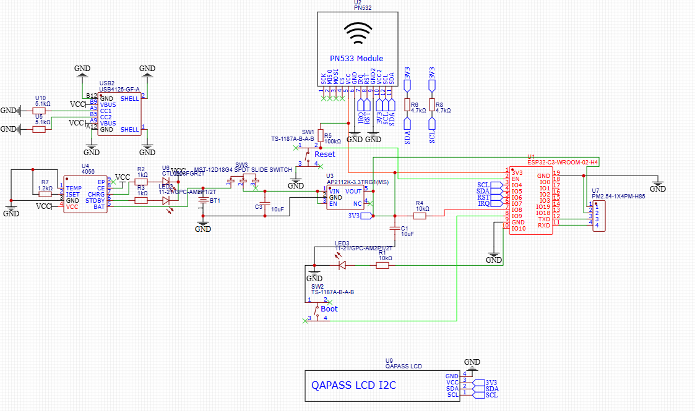
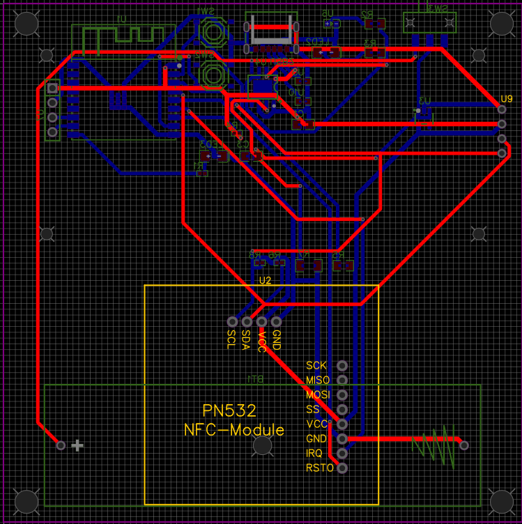
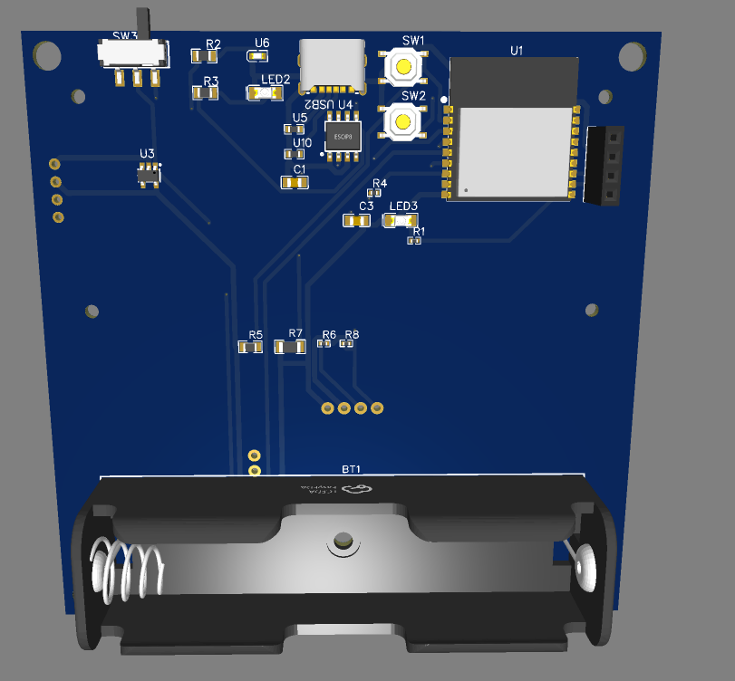
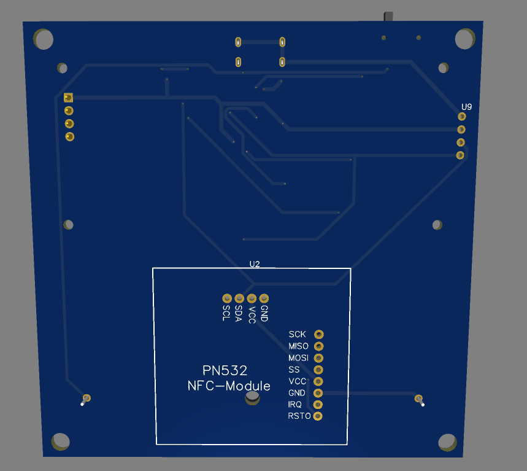
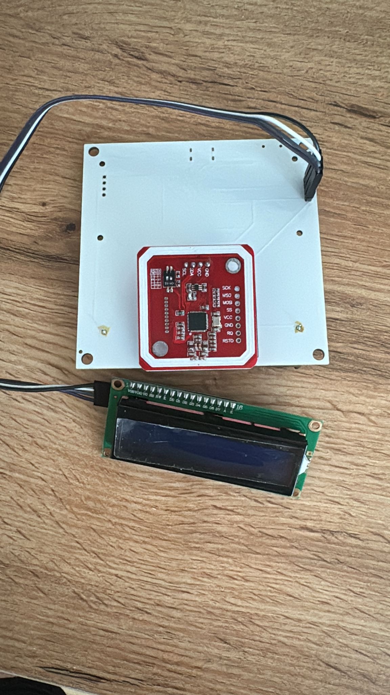
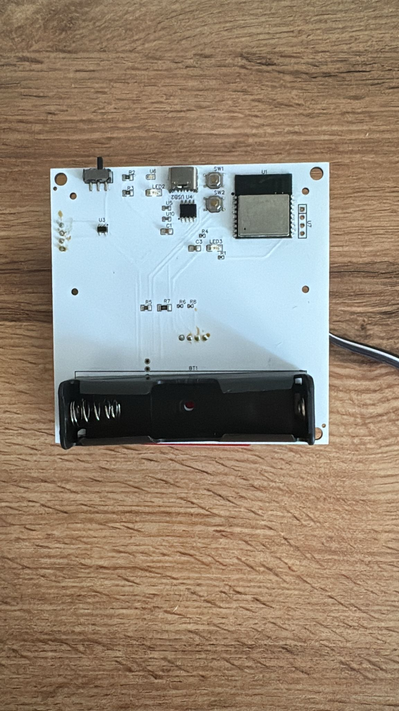
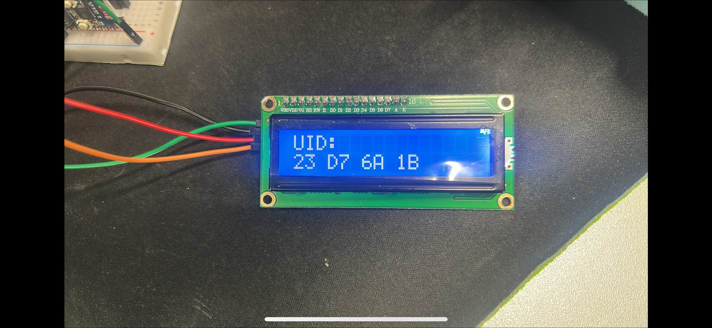

== Themenstellung von Wessel de Koo

[.lead]
Eine funktionsfähige, getestete Platine mit RFID-Lesegerät, die Mitarbeiterchips fehlerfrei erkennt und die Daten an die nachfolgenden Systeme weitergibt.
Das Modul bildet die Grundlage für die gesamte Zeiterfassung.

Die vorliegende Arbeit ist Teil des Gesamtprojekts _TimeCortex_, eines RFID-gestützten Zeiterfassungssystems.
Während sich andere Teilarbeiten mit dem Gehäuse, der Datenbank und der Weboberfläche befassen, behandelt dieser Abschnitt die zentrale Hardwarekomponente: eine eigens entworfene Leiterplatte, auf der ein Mikrocontroller, ein RFID-Lesemodul, ein Display sowie eine akkugepufferte Stromversorgung zusammengeführt werden.
Das Untersuchungsanliegen umfasst die Auswahl und Testung verschiedener Mikrocontroller und weiterer Bauteile, die Planung und Erstellung einer eigenen Platine, den Zusammenbau aller Komponenten sowie die Sicherstellung der Funktionsfähigkeit und Effizienz des Gesamtsystems.

Die Arbeit folgt dabei bewusst dem realen Entwicklungsverlauf:
Zunächst werden die theoretischen Grundlagen der eingesetzten Technologien erläutert, anschließend wird die Bauteilauswahl begründet, danach das Platinendesign beschrieben und schließlich die Fertigung, Bestückung und schrittweise Inbetriebnahme des Prototyps dokumentiert.

=== Theoretische Grundlagen

Bevor konkrete Bauteile ausgewählt und zu einer Schaltung verbunden werden können, ist ein Verständnis der zugrunde liegenden Technologien erforderlich.
Dieses Kapitel beschreibt daher zunächst allgemein das Funktionsprinzip der RFID-Technologie, die Einordnung von Mikrocontrollern gegenüber Mikrocomputern und die grundlegenden Begriffe des Leiterplattenentwurfs.
Erst auf dieser Basis lassen sich die späteren Entwurfsentscheidungen nachvollziehbar begründen.

==== RFID-Technologie

_RFID_ steht für _Radio-Frequency Identification_ und bezeichnet ein Verfahren zur kontaktlosen Identifikation von Objekten über elektromagnetische Felder (vgl. <<wiki-rfid>>).
Ein RFID-System besteht grundsätzlich aus zwei Komponenten: einem _Lesegerät_ (Reader, in der Normsprache _PCD_ – Proximity Coupling Device) und einem _Transponder_ (Tag, in der Normsprache _PICC_ – Proximity Integrated Circuit Card).
Der Transponder trägt einen kleinen Mikrochip mit einer eindeutigen Kennung sowie eine Antenne in Form einer Spule.

Man unterscheidet grundsätzlich zwischen _aktiven_ und _passiven_ Transpondern.
Aktive Transponder besitzen eine eigene Energiequelle und können dadurch größere Reichweiten erzielen, sind aber teurer und wartungsbedürftig.
Passive Transponder – wie die in dieser Arbeit verwendeten Mitarbeiterchips – besitzen keine eigene Energieversorgung, sondern beziehen die zum Betrieb nötige Energie aus dem Feld des Lesegeräts.
Genau diese Eigenschaft macht sie für eine Zeiterfassung ideal:
Die Chips sind günstig, wartungsfrei und praktisch unbegrenzt haltbar.

Das physikalische Grundprinzip eines passiven HF-Systems ist die _induktive Kopplung_.
Das Lesegerät erzeugt über seine Antennenspule ein magnetisches Wechselfeld mit einer Trägerfrequenz von 13,56 MHz.
Befindet sich die Spule des Transponders in diesem Feld, so wird darin nach dem Induktionsgesetz eine Spannung induziert, die den Chip mit Energie versorgt – das System verhält sich also wie ein lose gekoppelter Transformator (vgl. <<iso-14443-guide>>).
Die Datenübertragung vom Transponder zurück zum Lesegerät erfolgt durch _Lastmodulation_:
Der Transponder verändert im Takt seiner Antwortdaten den Stromverbrauch seiner Spule, was als kleine Rückwirkung im Feld des Lesegeräts messbar ist.

Damit eine effiziente Energie- und Signalübertragung stattfindet, müssen Lese- und Transponderantenne auf die Trägerfrequenz abgestimmt sein.
Die Resonanzfrequenz eines solchen Schwingkreises aus Spuleninduktivität latexmath:[L] und Kapazität latexmath:[C] ergibt sich aus der bekannten Thomson-Gleichung:

[latexmath]
++++
f_{res} = \frac{1}{2\pi\sqrt{L\,C}}
++++

Für 13,56 MHz wird die Antenne also so dimensioniert, dass latexmath:[f_{res}] möglichst nahe an der Trägerfrequenz liegt.
Eine schlecht abgestimmte Antenne verringert die Reichweite drastisch – ein Aspekt, der beim späteren Platinenlayout zu beachten ist, da Kupferflächen und Bauteile in der Nähe der Antenne deren Abstimmung verstimmen können.

Auf der Protokollebene ist für diese Arbeit die Normenfamilie _ISO/IEC 14443_ maßgeblich, die den De-facto-Standard für kontaktlose Chipkarten im Nahbereich (bis etwa 10 cm) definiert (vgl. <<iso-14443-guide>>).
Die Norm gliedert sich in mehrere Teile, die jeweils einen Aspekt der Kommunikation festlegen.

.Aufbau der Normenfamilie ISO/IEC 14443
[cols="1,3",options="header"]
|===
| Teil | Inhalt
| Teil 1 | Physikalische Eigenschaften der Karte (Abmessungen, Umweltanforderungen).
| Teil 2 | Hochfrequenz-Leistungs- und Signalschnittstelle (Modulation, Feldstärke, Typ A und Typ B).
| Teil 3 | Initialisierung und Antikollision – die Auswahl genau einer Karte aus mehreren im Feld.
| Teil 4 | Übertragungsprotokoll für den Datenaustausch nach erfolgter Auswahl.
|===

Innerhalb dieser Norm ist die von NXP entwickelte _MIFARE_-Familie der mit Abstand verbreitetste Kartentyp und nutzt die Variante Typ A (vgl. <<mifare-an>>).
Für die Zeiterfassung ist dabei nicht der oft verschlüsselte Speicherinhalt einer MIFARE-Karte entscheidend, sondern bereits die im Antikollisionsverfahren übertragene eindeutige Seriennummer, die _UID_ (Unique Identifier).
Jeder Mitarbeiterchip besitzt eine solche, weltweit praktisch eindeutige UID, die sich ohne Authentifizierung auslesen lässt und damit als digitaler Schlüssel zur Identifikation der Person dient.
Genau diese UID liest das in dieser Arbeit aufgebaute Modul aus und reicht sie an die nachgelagerten Systeme weiter.

Der grundsätzliche Ablauf einer Erfassung lässt sich als Sequenz zwischen Lesegerät und Transponder darstellen.

[plantuml,format=svg]
----
@startuml
skinparam shadowing false
actor "Mitarbeiter" as user
participant "Lesegerät\n(PCD / PN532)" as reader
participant "Chip\n(PICC / MIFARE)" as card

user -> card : Chip an Leser halten
reader -> card : 13,56-MHz-Feld (Energie)
note right of card : Induzierte Spannung\nversorgt den Chip
reader -> card : REQA (Karte im Feld?)
card --> reader : ATQA (Antwort)
reader -> card : Antikollision / SELECT
card --> reader : UID
reader -> reader : UID an Mikrocontroller
@enduml
----

==== Mikrocontroller und Mikrocomputer

Das Herzstück jeder eingebetteten Schaltung ist die Recheneinheit, die Sensoren ausliest, Aktoren ansteuert und die Programmlogik ausführt.
Hier ist begrifflich zwischen einem _Mikrocomputer_ und einem _Mikrocontroller_ zu unterscheiden, da diese Wahl die gesamte Architektur der Platine prägt.

Ein _Mikrocomputer_ – ein typischer Vertreter ist der Raspberry Pi – ist im Kern ein vollwertiger, wenn auch kleiner Computer.
Er besitzt einen leistungsfähigen Prozessor, mehrere hundert Megabyte bis Gigabyte Arbeitsspeicher und führt in der Regel ein vollwertiges Betriebssystem wie Linux aus.
Dadurch eignet er sich für rechenintensive Aufgaben wie Bildverarbeitung oder das Betreiben von Servern, benötigt aber vergleichsweise viel Energie, eine geregelte Stromversorgung und einen Massenspeicher.

Ein _Mikrocontroller_ hingegen ist ein hochintegrierter Ein-Chip-Rechner, der Prozessorkern, Arbeitsspeicher (RAM), Programmspeicher (Flash) und zahlreiche Peripherieschnittstellen auf einem einzigen Baustein vereint.
Er besitzt kein Betriebssystem im klassischen Sinn, sondern führt ein einzelnes, fest eingebranntes Programm (die _Firmware_) aus.
Mikrocontroller sind dafür ausgelegt, mit minimalem Energieverbrauch direkt mit der physischen Welt zu interagieren – sie lesen digitale und analoge Eingänge, schalten Ausgänge und kommunizieren über serielle Busse mit Sensoren und Modulen.

Für ein Zeiterfassungsterminal, das im Wesentlichen einen RFID-Chip auslesen, eine Information anzeigen und das Ergebnis über das Netzwerk versenden soll, ist ein Mikrocontroller die naheliegende Wahl.
Die Aufgabe ist nicht rechenintensiv, dafür sind geringer Stromverbrauch (für den Akkubetrieb), geringe Kosten und eine direkte Anbindung von Peripherie über Busse wie _I²C_ entscheidend.
Ein vollwertiger Mikrocomputer wäre an dieser Stelle deutlich überdimensioniert, teurer und energiehungriger.

Die Kommunikation mit den Peripheriemodulen erfolgt im vorliegenden Projekt überwiegend über den _I²C-Bus_ (Inter-Integrated Circuit).
Dieser serielle Zweidraht-Bus benötigt lediglich zwei Leitungen – eine Taktleitung (_SCL_) und eine Datenleitung (_SDA_) – und erlaubt es, mehrere Bausteine mit jeweils eigener Adresse an denselben zwei Leitungen zu betreiben.
Diese Eigenschaft ist für ein platzsparendes Platinendesign besonders attraktiv, da sowohl das RFID-Modul als auch das Display über dieselben beiden Leitungen angebunden werden können.
Beide Leitungen sind als _Open-Drain_ ausgeführt und benötigen daher Pull-up-Widerstände, ein Detail, das im Schaltungsentwurf wieder aufgegriffen wird.

==== Grundlagen des Platinenentwurfs

Eine _Leiterplatte_ (engl. _Printed Circuit Board_, PCB) ist der mechanische und elektrische Träger einer elektronischen Schaltung.
Sie besteht aus einem isolierenden Grundmaterial – üblicherweise dem glasfaserverstärkten Epoxidharz _FR4_ – auf das eine oder mehrere Lagen Kupfer aufgebracht sind.
Aus diesen Kupferlagen werden durch ein fotochemisches Ätzverfahren die _Leiterbahnen_ herausgearbeitet, welche die Bauteile elektrisch miteinander verbinden und damit die früher übliche fliegende Verdrahtung ersetzen.

Der Entwurf einer Leiterplatte verläuft in zwei klar getrennten Schritten, die auch in dieser Arbeit die Gliederung vorgeben.

Im ersten Schritt entsteht der _Schaltplan_ (Schematic).
Er ist eine rein logische, abstrakte Darstellung der Schaltung:
Er beschreibt, _welche_ Bauteile es gibt und _wie_ sie elektrisch verbunden sind, ohne eine Aussage über ihre physische Anordnung zu treffen.
Bauteile werden durch genormte Symbole repräsentiert, Verbindungen durch Linien (_Netze_).

Im zweiten Schritt folgt das _Layout_ (PCB-Design).
Hier werden die im Schaltplan definierten Bauteile durch ihre realen _Footprints_ – die exakten Lötflächen und Bohrungen des physischen Gehäuses – ersetzt und physisch auf der Platinenfläche platziert.
Anschließend werden die logischen Netze des Schaltplans als reale Kupferbahnen verlegt (das sogenannte _Routing_).
Dabei sind zahlreiche physikalische Randbedingungen zu beachten, etwa Mindestabstände zwischen Leiterbahnen, ausreichende Bahnbreiten für höhere Ströme und eine durchgehende Massefläche zur Verbesserung der Störfestigkeit.

Man unterscheidet Leiterplatten nach der Anzahl ihrer Kupferlagen.
Einfache Schaltungen kommen mit einer einseitigen Platine aus, während komplexe Designs vier oder mehr Lagen benötigen.
Für das vorliegende Projekt wurde eine _zweilagige_ Platine gewählt, die einen guten Kompromiss zwischen Fertigungskosten und Verdrahtungsfreiheit darstellt:
Die Bauteile und der Großteil der Signale liegen auf der Oberseite, während die Unterseite überwiegend als durchgehende Massefläche und für kreuzende Verbindungen genutzt wird.
Verbindungen zwischen den beiden Lagen werden über metallisierte Bohrungen, sogenannte _Vias_, hergestellt.

Der gesamte Entwurf wurde in der webbasierten EDA-Software _EasyEDA_ erstellt, deren Projektdateien (Schaltplan und Layout) eine zentrale Quelle dieser Arbeit bilden.
EasyEDA ist eng mit dem Fertiger JLCPCB sowie dem Bauteilkatalog von LCSC verzahnt, wodurch ein durchgängiger Weg vom Schaltplan bis zur bestellten Platine entsteht.

=== Recherche der optimalen Komponenten

Ein wesentlicher Teil dieser Arbeit bestand in der sorgfältigen Auswahl der Bauteile.
Diese Recherche nahm – wie aus dem Begleitprotokoll ersichtlich – einen erheblichen Anteil der Projektzeit in Anspruch, da jede Komponente nicht nur ihre Funktion erfüllen, sondern auch hinsichtlich Betriebsspannung, Schnittstellen, Verfügbarkeit, Lieferzeit und Kosten zum Gesamtsystem passen muss.
Dieses Kapitel begründet die getroffene Auswahl, indem es jeweils zunächst die Anforderungen und alternative Lösungen darstellt und anschließend die konkrete Entscheidung herleitet.

==== Vergleich und Auswahl des Mikrocontrollers

Als zentrale Anforderung an den Mikrocontroller galt eine integrierte WLAN-Schnittstelle, da die erfassten Zeitstempel an ein nachgelagertes Backend übertragen werden müssen.
Weiterhin waren ein niedriger Energieverbrauch für den Akkubetrieb, eine ausreichende Anzahl an GPIO-Pins, ein I²C-Controller sowie geringe Kosten und gute Verfügbarkeit gefordert.

Für die Vorauswahl wurden drei in der Praxis verbreitete Plattformen gegenübergestellt.

.Vergleich möglicher Mikrocontroller-Plattformen
[cols="1,1,1,1",options="header"]
|===
| Kriterium | ATmega328P (Arduino Uno) | ESP8266 | ESP32-C3
| Funk | keiner | WLAN | WLAN + Bluetooth LE
| Kern | 8-bit AVR, 16 MHz | 32-bit, 80 MHz | 32-bit RISC-V, bis 160 MHz
| GPIO | ~20 | begrenzt (~9 nutzbar) | 15 (modulabhängig)
| Betriebsspannung | 5 V | 3,3 V | 3,3 V
| Eignung | kein Funk | wenig freie Pins | sehr gut geeignet
|===

Der _ATmega328P_, bekannt aus dem Arduino Uno, schied früh aus, da er über keinerlei Funkschnittstelle verfügt;
ein externes WLAN-Modul hätte die Schaltung unnötig verkompliziert und verteuert.
Der _ESP8266_ bringt zwar WLAN mit, stellt aber nur sehr wenige frei nutzbare GPIO-Pins bereit und besitzt einige Pins mit Boot-Sonderfunktionen, was den Schaltungsentwurf einschränkt.

Die Wahl fiel auf den _ESP32-C3_ von Espressif, konkret auf das Modul _ESP32-C3-WROOM-02-H4_.
Dieses Modul vereint einen 32-bit-RISC-V-Single-Core-Prozessor mit bis zu 160 MHz Taktfrequenz, 400 KB SRAM und 4 MB integriertem Flash-Speicher und integriert sowohl 2,4-GHz-WLAN (Wi-Fi 4) als auch Bluetooth 5 (LE) auf einem einzigen Baustein mit aufgedruckter PCB-Antenne (vgl. <<esp-c3-ds>>, <<esp-c3-soc>>).
Es bricht 15 GPIO-Pins heraus, verfügt über einen I²C-Controller und arbeitet mit 3,3 V Betriebsspannung – ein Wert, der zugleich die Spannungsebene des gesamten Designs vorgibt.

Ein für die Programmierung praktischer Vorteil des ESP32-C3 ist sein integrierter _USB-Serial/JTAG-Controller_ sowie die unkomplizierte Unterstützung durch das Arduino-Framework, das die Entwicklung der Firmware erheblich vereinfacht.
Im konkreten Anwendungsfall fungiert der ESP32-C3 als zentrale Steuereinheit:
Er liest über I²C die UID vom RFID-Modul, zeigt Rückmeldungen auf dem Display an und überträgt die Erfassungsdaten per WLAN an das Backend.
Damit deckt ein einziger, kostengünstiger Baustein sämtliche Steuerungs- und Kommunikationsaufgaben ab.

==== Vergleich und Auswahl des RFID-Moduls

Für das Auslesen der Mitarbeiterchips standen im Wesentlichen zwei am Markt verbreitete Modulfamilien zur Auswahl, die beide bei 13,56 MHz arbeiten.

Die erste Option ist der weit verbreitete und sehr günstige _MFRC522_.
Dieser Leser unterstützt jedoch ausschließlich die SPI-Schnittstelle zuverlässig und ist auf MIFARE-Karten nach ISO 14443A beschränkt.
Die zweite Option ist der _PN532_ von NXP, ein deutlich vielseitigerer Baustein.

Die Entscheidung fiel auf ein _PN532-Modul_, das gleich mehrere Vorteile bietet (vgl. <<pn532-um>>, <<elechouse-pn532>>).
Der PN532 ist ein hochintegrierter Transceiver für die kontaktlose Kommunikation bei 13,56 MHz, der nicht nur als Lesegerät für ISO-14443A/MIFARE-Karten dient, sondern auch FeliCa und den vollständigen NFC-Standard (inklusive Peer-to-Peer- und Kartenemulationsmodus) beherrscht.
Sein entscheidender praktischer Vorteil ist die Unterstützung dreier Host-Schnittstellen – SPI, High-Speed-UART (HSU) und _I²C_ – die sich am Modul per Schalter oder Lötbrücke umstellen lassen.

Für dieses Projekt wurde der PN532 im _I²C-Modus_ betrieben.
Damit kann er sich denselben Zweidraht-Bus mit dem Display teilen und benötigt nur zwei Signalleitungen zum Mikrocontroller, was das Layout vereinfacht und Pins am ESP32-C3 spart.
Der PN532 arbeitet mit einer Betriebsspannung von 2,7 V bis 5,5 V und besitzt mehrere Stromsparmodi (im Hard-Power-Down typisch nur 1 µA), was dem Ziel eines energieeffizienten, akkubetriebenen Geräts entgegenkommt (vgl. <<pn532-ds>>).
Da der PN532 bereits die komplette Hochfrequenz-Analogtechnik samt Modulator und Demodulator integriert, übernimmt er die anspruchsvolle Aufgabe der Felderzeugung und Signalauswertung vollständig und liefert dem ESP32-C3 fertig dekodierte UIDs.

==== Auswahl weiterer Bauteile (Display, Stromversorgung, Ladeelektronik)

Neben den beiden Hauptkomponenten waren zahlreiche weitere Bauteile auszuwählen, die das System erst eigenständig betriebsfähig machen.

*Display.*
Zur Rückmeldung an den Benutzer – etwa der Anzeige der gelesenen UID oder einer Bestätigung – wurde ein zeichenorientiertes _LCD vom Typ 1602_ (16 Zeichen × 2 Zeilen, vom Hersteller mit „QAPASS“ bedruckt) gewählt.
Solche Displays basieren auf dem Industriestandard-Controller _HD44780_.
In ihrer Grundform würden sie jedoch zahlreiche parallele Datenleitungen benötigen.
Daher wurde eine Variante mit aufgelötetem _I²C-Adapter_ auf Basis des Portexpanders _PCF8574_ verwendet, der die parallele Ansteuerung auf zwei I²C-Leitungen reduziert (vgl. <<lcd-i2c>>).
Dadurch fügt sich das Display nahtlos in den ohnehin vorhandenen I²C-Bus ein und teilt sich diesen mit dem PN532; die Anzeige besitzt typischerweise die I²C-Adresse 0x27.

*Stromversorgung.*
Da sowohl der ESP32-C3 (3,3 V) als auch der PN532 und das Display von einer stabilen Spannung versorgt werden müssen, wird ein _Low-Dropout-Spannungsregler_ (LDO) benötigt.
Die Wahl fiel auf den _AP2112K-3.3_ von Diodes Incorporated, einen CMOS-LDO im kompakten SOT-23-5-Gehäuse.
Er liefert eine fest eingestellte Ausgangsspannung von 3,3 V mit einer Genauigkeit von ±1,5 % bei einem maximalen Ausgangsstrom von 600 mA und einer typischen Dropout-Spannung von nur 400 mV bei Volllast (vgl. <<ap2112-ds>>).
Die geringe Dropout-Spannung ist im Akkubetrieb entscheidend, da die Zellspannung eines Lithium-Ionen-Akkus im Betrieb absinkt und ein Regler mit hohem Spannungsabfall die nutzbare Akkukapazität verschwenden würde.
Ein zusätzlicher Vorteil ist der _Enable_-Eingang, über den sich der Regler abschalten lässt.

*Ladeelektronik und Energiequelle.*
Als Energiequelle dient ein wiederaufladbarer Lithium-Ionen-Akku der Baugröße _18650_, für den auf der Platine ein Batteriehalter (BT1) vorgesehen ist.
Zum Laden dieses Akkus über die USB-C-Buchse wird der weit verbreitete Lade-IC _TP4056_ eingesetzt, ein linearer Einzelzellen-Lader, der das normgerechte Constant-Current/Constant-Voltage-Verfahren (CC/CV) mit einer Ladeschlussspannung von 4,2 V umsetzt (vgl. <<tp4056-ds>>).
Der maximale Ladestrom wird über einen einzigen Widerstand (latexmath:[R_{PROG}]) eingestellt, wobei näherungsweise gilt:

[latexmath]
++++
I_{BAT} = \frac{1200\,\text{V}\cdot\Omega}{R_{PROG}}
++++

Mit dem im Design verwendeten Widerstand von 1,2 kΩ ergibt sich somit ein Ladestrom von etwa 1 A.
Der TP4056 signalisiert über zwei LED-Ausgänge den laufenden Ladevorgang sowie das Ladeende.

*USB-C-Buchse.*
Die Energiezufuhr erfolgt über eine moderne _USB-C-Buchse_.
Damit ein Standard-USB-C-Netzteil die Buchse überhaupt als Verbraucher (Sink) erkennt und Strom freigibt, müssen die beiden Konfigurationskanäle (_CC1_ und _CC2_) jeweils über einen 5,1-kΩ-Widerstand auf Masse gezogen werden (vgl. <<usbc-cc>>).
Werden diese Pull-down-Widerstände vergessen, liefert ein USB-C-Netzteil keinen oder nur einen stark begrenzten Strom – ein klassischer und leicht zu übersehender Designfehler, der hier von vornherein berücksichtigt wurde.

Ergänzt wird die Schaltung durch zwei Taster für _Reset_ und _Boot_ (zur Programmierung des ESP32-C3), einen Schiebeschalter zum Ein- und Ausschalten des Geräts sowie die für den I²C-Bus erforderlichen Pull-up-Widerstände und Stützkondensatoren.

=== Planung und Design der Platine

Mit den ausgewählten Bauteilen konnte der eigentliche Entwurf beginnen.
Dieser gliedert sich, wie in den Grundlagen beschrieben, in die Erstellung des Schaltplans und das anschließende PCB-Layout.

==== Erstellung des Schaltplans

Der Schaltplan führt alle ausgewählten Komponenten zu einem logisch verbundenen Gesamtsystem zusammen.
Im Zentrum steht der ESP32-C3 (U1), um den herum sich die Funktionsblöcke Stromversorgung, RFID-Leser und Display gruppieren.

.Vollständiger Schaltplan des TimeCortex-Moduls in EasyEDA
[#fig-schaltplan]

Die Architektur der Schaltung lässt sich in drei logische Domänen einteilen, deren Zusammenspiel das folgende Blockdiagramm verdeutlicht.

[plantuml,format=svg]
----
@startuml
skinparam shadowing false
skinparam componentStyle rectangle

[USB-C-Buchse] as usb
[TP4056\nLade-IC] as charger
[18650-Akku] as bat
[Schiebeschalter] as sw
[AP2112K-3.3\nLDO 3,3 V] as ldo
[ESP32-C3\nWROOM-02] as mcu
[PN532\nRFID-Leser] as pn532
[LCD 1602\n(I2C)] as lcd

usb --> charger : 5 V (VBUS)
charger --> bat : Laden (CC/CV)
bat --> sw : Akkuspannung
sw --> ldo : geschaltet
ldo --> mcu : 3,3 V
ldo --> pn532 : 3,3 V
ldo --> lcd : 3,3 V
mcu <--> pn532 : I2C (SDA/SCL)
mcu <--> lcd : I2C (SDA/SCL)
mcu ..> [WLAN-Backend] : WLAN
@enduml
----

*Stromversorgungspfad.*
Die über die USB-C-Buchse (USB2) bereitgestellten 5 V (VBUS) gelangen zunächst an den Eingang des TP4056 (U4), der den 18650-Akku (BT1) lädt.
Die beiden CC-Leitungen der USB-C-Buchse sind über je einen 5,1-kΩ-Widerstand (U5, U10) mit Masse verbunden, sodass ein USB-C-Netzteil korrekt erkannt wird.
Der Ladestrom wird durch den PROG-Widerstand (R7, 1,2 kΩ) auf rund 1 A festgelegt;
zwei LEDs zeigen Lade- und Bereitschaftszustand an.
Die Akkuspannung wird über den Schiebeschalter (SW3) geführt und gelangt von dort an den Eingang des LDO (U3, AP2112K-3.3), der daraus die stabile 3,3-V-Versorgung für die gesamte restliche Schaltung erzeugt.
Eingangs- und Ausgangsseite des Reglers sind mit jeweils 10-µF-Kondensatoren (C1, C3) gestützt, wie es das Datenblatt für einen stabilen Betrieb fordert.

*Signal- und Busführung.*
Der RFID-Leser (U2, PN532) und das Display (U9) sind gemeinsam an den I²C-Bus des ESP32-C3 angeschlossen.
Da I²C-Leitungen als Open-Drain ausgeführt sind, befinden sich auf den Leitungen SDA und SCL die erforderlichen Pull-up-Widerstände (R6 und R8, je 4,7 kΩ), die den Bus in den definierten High-Pegel ziehen.
Der Reset-Taster (SW1) wirkt über einen Pull-up-Widerstand (R5, 100 kΩ) auf den EN-Pin des Mikrocontrollers, der Boot-Taster (SW2) auf den entsprechenden Strapping-Pin (IO9), sodass sich der ESP32-C3 für die Programmierung in den Download-Modus versetzen lässt.
Über den vierpoligen Stiftleisten-Header (U7) sind die UART-Signale (TXD/RXD) zum Aufspielen der Firmware nach außen geführt.

==== PCB-Layout und Fertigungsvorbereitung

Nach Fertigstellung des Schaltplans wurden die Bauteile auf der zweilagigen Platine platziert und die logischen Netze als Kupferbahnen verlegt.
Bei der Platzierung waren neben der reinen elektrischen Verbindung mehrere praktische Aspekte zu berücksichtigen.

.Layout (Routing) der zweilagigen Platine
[#fig-pcb]

Eine zentrale Designentscheidung betrifft die Anordnung des RFID-Lesers.
Die Antenne des PN532 darf nicht von Kupferflächen überdeckt werden, da diese als Wirbelstrombremse das 13,56-MHz-Feld dämpfen und so die Lesereichweite drastisch verringern würden.
Aus diesem Grund wurde dem PN532 ein eigener, klar abgegrenzter Bereich der Platine zugewiesen (im Layout deutlich als rechteckiger Block erkennbar).
Die übrigen Bauteile – Mikrocontroller, USB-Buchse, Ladeelektronik und der Batteriehalter – wurden auf der gegenüberliegenden Seite der Platine konzentriert.

Da das Ergebnis eines reinen 2D-Layouts schwer zu beurteilen ist, bietet EasyEDA eine fotorealistische 3D-Vorschau, mit der sich Bauteilplatzierung, Beschriftungen und mögliche Kollisionen vor der Fertigung überprüfen lassen.

.3D-Vorschau der Bestückungsseite (ESP32-C3, USB-C, Taster, Batteriehalter)
[#fig-3d-back]

.3D-Vorschau der Leserseite mit Aufnahme für das PN532-Modul
[#fig-3d-front]

In der 3D-Vorschau ist die durchdachte Aufteilung gut zu erkennen:
Auf der einen Seite befindet sich der dicht bestückte Bereich mit dem ESP32-C3-Modul, der USB-C-Buchse, den Reset- und Boot-Tastern, dem Schiebeschalter und dem Halter für den 18650-Akku.
Die gegenüberliegende Seite trägt die Anschlussfelder für das PN532-Modul sowie für das Display und hält die kritische Antennenregion frei von störendem Kupfer.

Nach der visuellen Kontrolle und einem automatischen Design-Rule-Check (DRC), der Mindestabstände und Bahnbreiten prüft, wurden die Fertigungsdaten erzeugt.
EasyEDA exportiert hierfür die branchenüblichen _Gerber-Dateien_, welche jede Kupfer-, Lötstopp- und Bestückungsdrucklage einzeln beschreiben, sowie eine Bohrdatei.
Diese Daten bilden die Grundlage für die Bestellung der Leiterplatte beim Fertiger.

=== Erstellung der Platine

Mit den fertigen Produktionsdaten konnte die Platine gefertigt und anschließend schrittweise zum Leben erweckt werden.

==== Fertigung der Leiterplatte

Die Fertigung der eigentlichen Leiterplatte erfolgte über einen industriellen Leiterplattenhersteller, an den die exportierten Gerber-Daten übermittelt wurden.
Der Hersteller belichtet, ätzt, bohrt und metallisiert die Lagen und versieht die Platine mit Lötstopplack (der das charakteristische farbige Erscheinungsbild erzeugt) sowie einem weißen Bestückungsdruck mit den Bauteilbezeichnungen.
Diese industrielle Fertigung erreicht eine Präzision und Reproduzierbarkeit, die mit einer manuell geätzten Platine im Schulkontext nicht erreichbar wäre, und ermöglicht zugleich die für die feinen Bauteile nötigen durchkontaktierten Vias.

Das Ergebnis ist eine professionell gefertigte Leiterplatte mit weißem Lötstopplack, die in der nächsten Phase bestückt wurde.

==== Grundbestückung und Inbetriebnahme

Ein Teil der Bauteile – insbesondere die feinen SMD-Komponenten der Stromversorgung – wurde im Rahmen der Grundbestückung auf die gelieferte Platine aufgebracht.
Das Ergebnis dieser Grundbestückung zeigt die folgende Abbildung der realen Baugruppe.

.Reale, grundbestückte Platine (Komponentenseite)
[#fig-real-front]

Auf der bestückten Platine sind das ESP32-C3-Modul, die USB-C-Buchse, die Taster, der Schiebeschalter sowie der Halter für den 18650-Akku deutlich zu erkennen.
Die weiße Platinenfarbe und der saubere Bestückungsdruck bestätigen die professionelle Fertigungsqualität.
In dieser Phase wurde die grundlegende Stromversorgung erstmals in Betrieb genommen und überprüft, bevor die empfindlicheren Module ergänzt wurden.

=== Lötung der fehlenden Komponenten

Nach der Grundbestückung mussten die beiden größeren Funktionsmodule – der RFID-Leser und das Display – manuell angelötet werden.
Diese Lötarbeiten wurden eigenständig durchgeführt und stellten einen wesentlichen praktischen Anteil der Arbeit dar.

==== RFID-Chip (PN532)

Das PN532-Modul wurde über seine Anschlussfelder mit der Platine verbunden.
Wie im Schaltplan vorgesehen, wurde der Leser im I²C-Modus betrieben, sodass lediglich die vier Leitungen für Versorgung (3,3 V, GND) und Bus (SDA, SCL) anzuschließen waren.
Beim manuellen Anlöten war besonders auf saubere, kurzschlussfreie Lötstellen zu achten, da bereits eine einzige Brücke zwischen SDA und SCL den gesamten Bus blockiert hätte.

==== Display

Anschließend wurde das LCD-1602-Display mit seinem I²C-Adapter angelötet.
Da das Display über denselben I²C-Bus wie der PN532 betrieben wird, teilen sich beide Module die Leitungen SDA und SCL und sind allein über ihre unterschiedlichen Busadressen unterscheidbar.
Die folgende Abbildung zeigt die Baugruppe mit dem angeschlossenen PN532-Modul (rote Platine) und dem LCD-Display.

.Manuell ergänztes PN532-Modul (rot) und LCD-Display
[#fig-real-back]

Mit dem Anlöten dieser beiden Module war die Hardware vollständig aufgebaut und bereit für die schrittweise Funktionsprüfung der einzelnen Komponenten.

=== Testen der einzelnen Komponenten

Eine bewährte Vorgehensweise bei der Inbetriebnahme komplexer Schaltungen ist das schrittweise Testen einzelner Funktionsblöcke, bevor das Gesamtsystem erprobt wird.
Dadurch lassen sich Fehler eingrenzen, da bei jedem Schritt nur eine überschaubare Zahl möglicher Fehlerquellen hinzukommt.

==== Test des Mikrocontrollers (ESP32-C3)

Zuerst wurde der Mikrocontroller selbst geprüft.
Über den UART-Header wurde eine einfache Firmware aufgespielt, die zunächst nur Statusmeldungen über die serielle Schnittstelle ausgibt.
Bereits dieser erste Test bestätigt mehrere Dinge gleichzeitig:
dass der LDO eine saubere 3,3-V-Versorgung liefert, dass das ESP32-C3-Modul korrekt verlötet ist und dass sich die Firmware über Boot- und Reset-Taster aufspielen lässt.
Erst nach erfolgreichem Bestehen dieses Grundtests wurde mit dem Anschluss der Peripherie fortgefahren.

==== Test des RFID-Lesers

Der zentrale Funktionstest galt dem RFID-Leser.
Hierfür wurde eine kompakte Testfirmware verwendet, die den PN532 über I²C initialisiert, dessen Firmware-Version ausliest und anschließend kontinuierlich nach Karten im Feld sucht.
Der nachfolgende Quelltext zeigt die wesentlichen Teile dieses Tests.

.Testfirmware zum Auslesen der UID über den PN532 (I²C)
[source,cpp]
----
#include <Wire.h>
#include <Adafruit_PN532.h>

#define SDA_PIN 5                        // <1>
#define SCL_PIN 4

Adafruit_PN532 nfc(-1, -1);              // <2>

void setup() {
  Serial.begin(115200);
  Wire.begin(SDA_PIN, SCL_PIN);          // <3>
  Wire.setClock(100000);

  nfc.begin();
  uint32_t v = nfc.getFirmwareVersion(); // <4>
  if (!v) {
    Serial.println("FAIL: PN532 nicht gefunden");
    while (1) delay(1000);               // <5>
  }
  Serial.print("OK: PN532 FW = 0x");
  Serial.println(v, HEX);

  nfc.SAMConfig();                        // <6>
}

void loop() {
  uint8_t uid[7];
  uint8_t uidLength;

  // Blocking read for an ISO14443A card in the field
  bool ok = nfc.readPassiveTargetID(PN532_MIFARE_ISO14443A,
                                     uid, &uidLength); // <7>
  if (ok) {
    Serial.print("UID: ");
    for (uint8_t i = 0; i < uidLength; i++) {          // <8>
      if (uid[i] < 0x10) Serial.print("0");
      Serial.print(uid[i], HEX);
      if (i < uidLength - 1) Serial.print(" ");
    }
    Serial.println();
    delay(800);
  }
}
----

<1> Festlegung der I²C-Pins; SDA an GPIO 5, SCL an GPIO 4 des ESP32-C3.
<2> Instanziierung des PN532 im I²C-Modus (beide SPI-Pins auf -1 gesetzt).
<3> Initialisierung des I²C-Busses mit 100 kHz Taktrate.
<4> Auslesen der Firmware-Version – dient zugleich als Erreichbarkeitstest des Bausteins.
<5> Wird der Leser nicht gefunden, hält das Programm bewusst an (klare Fehlerdiagnose).
<6> Konfiguration des _Security Access Module_; versetzt den PN532 in den Lesebetrieb.
<7> Blockierende Suche nach einer ISO-14443A-Karte; liefert bei Erfolg UID und deren Länge.
<8> Formatierte Ausgabe der UID als Hexadezimalwerte über die serielle Schnittstelle.

Dieser Test ist bewusst minimal gehalten und verzichtet auf Display und Netzwerk, um ausschließlich die Funktion des RFID-Lesers und der I²C-Kommunikation zu verifizieren.
Die zentrale Funktion ist `readPassiveTargetID`, die das gesamte in den Grundlagen beschriebene Antikollisions- und Auswahlverfahren kapselt und im Erfolgsfall die UID der Karte zurückliefert.
Wird beim Programmstart die Meldung mit gültiger Firmware-Version ausgegeben und beim Auflegen eines Chips dessen UID angezeigt, ist die Kernfunktion des Moduls nachgewiesen.

Im nächsten Schritt wurde die Ausgabe zusätzlich auf das LCD-Display geleitet, um die Funktion ohne angeschlossenen Computer überprüfen zu können.
Das folgende Beispiel skizziert exemplarisch, wie die ausgelesene UID auf dem I²C-Display dargestellt wird.

.Exemplarische Erweiterung zur UID-Anzeige auf dem LCD
[source,cpp]
----
#include <LiquidCrystal_I2C.h>

LiquidCrystal_I2C lcd(0x27, 16, 2);     // <1>

void showUid(uint8_t *uid, uint8_t len) {
  lcd.clear();
  lcd.setCursor(0, 0);
  lcd.print("UID:");                    // <2>
  lcd.setCursor(0, 1);
  for (uint8_t i = 0; i < len; i++) {   // <3>
    if (uid[i] < 0x10) lcd.print("0");
    lcd.print(uid[i], HEX);
    if (i < len - 1) lcd.print(" ");
  }
}
----

<1> Initialisierung des LCD über die I²C-Adresse 0x27 mit 16 Spalten und 2 Zeilen.
<2> Ausgabe einer Beschriftung in der ersten Zeile.
<3> Formatierte Ausgabe der UID-Bytes in der zweiten Zeile des Displays.

Das Ergebnis dieses kombinierten Tests ist in der folgenden Abbildung dokumentiert:
Das Display zeigt nach dem Auflegen eines Mitarbeiterchips dessen UID („23 D7 6A 1B“) an.

.Erfolgreicher Funktionstest – das Display zeigt die ausgelesene UID
[#fig-ersttest]

==== Test der Stromversorgung und Ladeelektronik

Parallel zu den Funktionstests wurde die Stromversorgung eingehend vermessen.
Geprüft wurden insbesondere die Ausgangsspannung des LDO unter Last, das korrekte Erkennen der USB-C-Buchse durch ein Netzteil sowie der Ladevorgang des Akkus über den TP4056.
Mit einem Multimeter wurden die Spannungswerte an den relevanten Knoten kontrolliert und das Verhalten der Lade- und Bereitschafts-LEDs überprüft.
Diese Messungen – im Begleitprotokoll als wiederholtes Messen von Spannungswerten und Signalverläufen dokumentiert – stellten sicher, dass die Versorgung unter allen Betriebszuständen (USB-Betrieb, Akkubetrieb, Ladebetrieb) stabil bleibt.

=== Testen des Prototypen

Nachdem die Einzelkomponenten ihre Funktion bewiesen hatten, wurde das Gesamtsystem als Prototyp erprobt.

==== Gesamtsystemtest und Fehleranalyse

Im Gesamtsystemtest wurde das Zusammenspiel aller Komponenten unter realistischen Bedingungen untersucht.
Dabei zeigte sich, dass der gemeinsame Betrieb von RFID-Leser und Display auf demselben I²C-Bus erwartungsgemäß funktioniert, solange beide Module unterschiedliche Busadressen verwenden.
Der typische Ablauf einer Erfassung im Gesamtsystem lässt sich als Programmfluss darstellen.

[plantuml,format=svg]
----
@startuml
skinparam shadowing false
start
:System einschalten (Schiebeschalter);
:3,3-V-Versorgung durch LDO;
:I2C-Bus initialisieren;
:PN532 initialisieren (SAMConfig);
if (PN532 erreichbar?) then (nein)
  :Fehlermeldung anzeigen;
  stop
else (ja)
endif
repeat
  :Auf Karte im Feld warten;
  if (Karte erkannt?) then (ja)
    :UID auslesen;
    :UID auf LCD anzeigen;
    :UID an Backend senden (WLAN);
  else (nein)
  endif
repeat while (Dauerbetrieb) is (ja)
stop
@enduml
----

Im Zuge der Erprobung traten – wie bei Hardwareprojekten üblich – verschiedene Probleme zutage, die einer systematischen Fehleranalyse unterzogen wurden.
Dazu gehörten die Analyse von Signalverläufen und Spannungswerten sowie das Aufspüren fehlerhafter Lötstellen.
Ein wiederkehrendes Thema war zudem die Verfügbarkeit der Bauteile:
Es wurden gezielt alternative Komponenten hinsichtlich Lieferzeit, Grenzwerten und Kosten recherchiert und auf Kompatibilität geprüft, um das Design lieferfähig und robust zu halten.

==== Optimierungen und Korrekturen

Aufbauend auf der Fehleranalyse wurden mehrere Iterationen von Korrekturen und Optimierungen durchgeführt.
Fehlerhafte Bauteile wurden ausgetauscht, Lötstellen nachgearbeitet und einzelne Komponenten gegen besser geeignete oder besser verfügbare Varianten ersetzt.
Abschließende Tests bestätigten die Stabilität der Schaltung über längere Betriebszeiträume hinweg.

Im Ergebnis liegt damit eine funktionsfähige, getestete Platine vor, die Mitarbeiterchips zuverlässig erkennt, deren UID ausliest, dem Benutzer eine Rückmeldung auf dem Display gibt und die ausgelesenen Daten für die Weitergabe an die nachgelagerten Systeme bereitstellt.
Das Modul erfüllt damit seine Rolle als Grundlage der gesamten Zeiterfassung.
Mögliche Weiterentwicklungen betreffen vor allem eine konsequentere Nutzung der Stromsparmodi des PN532 sowie des Deep-Sleep-Modus des ESP32-C3, um die Akkulaufzeit im Dauerbetrieb weiter zu erhöhen.

<<<
[bibliography]
=== Literaturverzeichnis

* [[[wiki-rfid,1]]] Wikipedia. "Radio-frequency identification". URL: https://en.wikipedia.org/wiki/Radio-frequency_identification (abgerufen am 24.6.2026).
* [[[iso-14443-guide,2]]] RFID Card. "ISO/IEC 14443 – Identification, Contactless, Proximity RFID Cards Standard". URL: https://www.rfidcard.com/iso-iec-14443-identification-contactless-proximity-rfid-cards-standard/ (abgerufen am 24.6.2026).
* [[[mifare-an,3]]] NXP Semiconductors. "MIFARE 14443A – Application Note". URL: https://www.nxp.com/docs/en/user-guide/141520.pdf (abgerufen am 24.6.2026).
* [[[esp-c3-ds,4]]] Espressif Systems. "ESP32-C3-WROOM-02 & ESP32-C3-WROOM-02U Datasheet". URL: https://www.espressif.com/sites/default/files/documentation/esp32-c3-wroom-02_datasheet_en.pdf (abgerufen am 24.6.2026).
* [[[esp-c3-soc,5]]] Espressif Systems. "ESP32-C3 Wi-Fi & Bluetooth 5 (LE) MCU". URL: https://www.espressif.com/en/products/socs/esp32-c3 (abgerufen am 24.6.2026).
* [[[pn532-um,6]]] NXP Semiconductors. "PN532 User Manual (UM0701-02)". URL: https://www.nxp.com/docs/en/user-guide/141520.pdf (abgerufen am 24.6.2026).
* [[[pn532-ds,7]]] NXP Semiconductors. "PN532/C1 – Near Field Communication (NFC) controller – Data Sheet". URL: https://www.nxp.com/docs/en/nxp/data-sheets/PN532_C1.pdf (abgerufen am 24.6.2026).
* [[[elechouse-pn532,8]]] Elechouse. "PN532 NFC RFID Module V4 – I2C, SPI, UART". URL: https://www.elechouse.com/product/pn532-nfc-rfid-module-v4/ (abgerufen am 24.6.2026).
* [[[ap2112-ds,9]]] Diodes Incorporated. "AP2112 – 600mA CMOS LDO Regulator with Enable – Data Sheet". URL: https://www.diodes.com/assets/Datasheets/AP2112.pdf (abgerufen am 24.6.2026).
* [[[tp4056-ds,10]]] Components101. "TP4056A Li-ion Battery Charging/Discharging Module – Pinout, Uses & Datasheet". URL: https://components101.com/modules/tp4056a-li-ion-battery-chargingdischarging-module (abgerufen am 24.6.2026).
* [[[usbc-cc,11]]] Hackaday. "All About USB-C: Resistors And Emarkers". URL: https://hackaday.com/2023/01/04/all-about-usb-c-resistors-and-emarkers/ (abgerufen am 24.6.2026).
* [[[lcd-i2c,12]]] Handson Technology. "I2C Serial Interface 1602 LCD Module – User Guide". URL: https://www.handsontec.com/dataspecs/module/I2C_1602_LCD.pdf (abgerufen am 24.6.2026).

<<<
=== Abbildungsverzeichnis

* <<fig-schaltplan>>
* <<fig-pcb>>
* <<fig-3d-back>>
* <<fig-3d-front>>
* <<fig-real-front>>
* <<fig-real-back>>
* <<fig-ersttest>>

<<<
=== Begleitprotokoll

[cols="1,5,1",options="header"]
|===
| Datum | Tätigkeit | Dauer

| 23.09.2025 | Lastenheft | 1 h
| 24.09.2025 | Lastenheft | 2 h
| 25.09.2025 | Theorie durchbesprochen | 3 h
| 30.09.2025 | Platine angefangen | 3 h
| 03.10.2025 | Platine weitergemacht | 3 h
| 04.10.2025 | Mit der Logistik auseinandergesetzt | 2 h
| 08.10.2025 | Platine erweitert | 3 h
| 10.10.2025 | Rodas Besprechung | 1 h
| 12.10.2025 | Platine erweitert | 2 h
| 17.10.2025 | Rodas Besprechung | 1 h
| 20.10.2025 | Platine erweitert | 2 h
| 24.10.2025 | Rodas Besprechung | 1 h
| 26.10.2025 | Platine erweitert | 1.5 h
| 27.10.2025 | Platine erweitert | 1.5 h
| 31.10.2025 | Platine überarbeitet | 5 h
| 05.11.2025 | Optionale Funktionen hinzugefügt | 2 h
| 07.11.2025 | Rodas Besprechung | 1 h
| 12.11.2025 | Platine verfeinert | 1 h
| 14.11.2025 | Display hinzugefügt | 3 h
| 15.11.2025 | Mit dem LCD-Display beschäftigt | 3 h
| 22.11.2025 | LCD-Display eingebaut | 3 h
| 02.01.2026 | LCD-Display verfeinert | 2 h
| 09.01.2026 | Rodas Besprechung | 3 h
| 24.01.2026 | Platine verfeinert und analysiert | 4 h
| 25.01.2026 | Komponenten ausgetauscht | 3 h
| 26.01.2026 | Rodas Besprechung | 4 h
| 13.02.2026 | Analyse alternativer Bauteile hinsichtlich Lieferzeit | 5 h
| 16.02.2026 | Ersatz- bzw. Alternativkomponenten recherchiert und Kompatibilität verifiziert | 5 h
| 19.02.2026 | Abgleich von Datenblättern hinsichtlich Grenzwerte und Betriebsspannungen | 4 h
| 20.02.2026 | Kostenvergleich verschiedener Bauteiloptionen durchgeführt | 5 h
| 01.03.2026 | Beginn der Lötarbeiten an der Platine | 3 h
| 04.03.2026 | Ersten Funktionstest der Baugruppe durchgeführt | 4 h
| 05.03.2026 | Abstimmung und Planung der nächsten Entwicklungsschritte | 4 h
| 07.03.2026 | Einzeltests der verbauten Komponenten durchgeführt | 6 h
| 08.03.2026 | Fehlersuche und Optimierung nach Ersttests durchgeführt | 3 h
| 10.03.2026 | Erweiterung der Lötarbeiten und Nachbearbeitung fehlerhafter Verbindungen | 5 h
| 11.03.2026 | Optimierung der Baugruppe weitergeführt | 2 h
| 11.03.2026 | Fortsetzung der Lötarbeiten und Vervollständigung der Bestückung der Platine | 4 h
| 12.03.2026 | Fehlersuche und Analyse von Signalverläufen sowie Spannungswerten | 5 h
| 13.03.2026 | Austausch fehlerhafter Bauteile und Nacharbeit an Lötstellen | 3 h
| 14.03.2026 | Weitere Tests und Fehleranalyse durchgeführt | 3 h
| 14.03.2026 | Abschließende Tests und Optimierung der Schaltung hinsichtlich Stabilität | 6 h
| 15.03.2026 | Anpassungen basierend auf Testergebnissen | 3 h
| 16.04.2026 | Nachbearbeitung und kleinere Optimierungen an der Schaltung durchgeführt | 3 h
| 24.04.2026 | Rodas Besprechung | 2 h
| 05.05.2026 | Weitere Arbeiten zur Fertigstellung der Platine durchgeführt | 3 h
| 06.05.2026 | Begonnen mit dem Schreiben der Diplomarbeit | 3 h
| 22.05.2026 | Spannungswerte und Signalverläufe erneut gemessen | 3 h
| 25.05.2026 | Finalen Testlauf der Platine durchgeführt | 4 h
| 29.05.2026 | Letzte Fehler behoben und Platine fertiggestellt | 3 h

2+| *Summe* | *152 h*
|===
